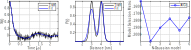

.. highlight:: matlab
.. _example_multigauss:

*****************************
Example - Multigauss fitting
*****************************

.. code-block:: matlab

    %========================================================
    % DeerAnalyis2
    % Example: Multi-Gauss fitting
    % Fit and an unknown number of Gaussian distributions to
    % a noisy signal
    %========================================================

    clear

    %Parameters
    %-------------------------
    N = 300;
    dt = 0.008;
    param0 = [3 0.3 4 0.3 0.5];
    NGauss = 6;

    %Preparation
    %-------------------------
    t = linspace(0,dt*N,N);
    r = time2dist(t);
    P = twogaussian(r,param0);
    K = dipolarkernel(t,r);

    %Generate dipolar signal with noise
    S = dipolarsignal(t,r,P,'NoiseLevel',0.05);

    %Run multi-Gauss fitting
    %-------------------------
    [Pfit,param,Nopt,metrics] = multigauss(S,K,r,NGauss,'aicc');

    fprintf('The optimal number of Gaussians is: %i \n',Nopt)

    %Plot results
    %-------------------------
    figure(8),clf

    subplot(131),hold on
    plot(t,S,'k','LineWidth',1)
    plot(t,K*Pfit,'b','LineWidth',1.5)
    grid on,box on,legend('Truth','Fit')
    xlabel('Time [\mus]'),ylabel('S(t)')

    subplot(132),hold on
    plot(r,P,'k','LineWidth',1.5)
    plot(r,Pfit,'b','LineWidth',1.5)
    grid on, box on, axis tight
    legend('Truth','Fit')
    xlabel('Distance [nm]'), ylabel('P(r)')

    subplot(133),hold on
    plot(metrics,'b-o','LineWidth',1.5)
    grid on,box on,axis tight
    legend('AICc')
    ylabel('Model Selection Metric'), xlabel('N-Gaussian model')

