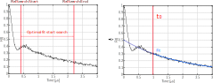

.. highlight:: matlab
.. _backgroundstart:

***********************
:mod:`backgroundstart`
***********************

Computes the optimal point for starting the background fit

-----------------------------

Syntax
=========================================

.. code-block:: matlab

    [t0,pos] = backgroundstart(V,t,model)
    [t0,pos] = backgroundstart(V,t,model,'Property',Value)

Parameters
    *   ``V`` - Signal (*N*-element array)
    *   ``t`` - Time axis (*N*-element array)
    *   ``model`` - Background model (function handle)
Returns
    *   ``t0`` - Optimal fitting start time (scalar)
    *   ``pos`` - Optimal fitting start index (scalar)

-----------------------------

Description
=========================================

.. code-block:: matlab

    [t0,pos] = backgroundstart(V,t,model)

Returns the optimal start time ``t0`` and corresponding array index ``pos`` at which to start fitting the background function corresponding to the model given by ``model``. The pre-defined background models defined by the ``model`` argument are the following:

* ``@td_exp`` - See :ref:`td_exp` for details.

* ``@td_strexp`` -  See :ref:`td_strexp` for details.

* ``@td_prodstrexp`` -  See :ref:`td_prodstrexp` for details.

* ``@td_sumstrexp`` -  See :ref:`td_sumstrexp` for details.

*  ``@td_poly1``, ``@td_poly2``, ``@td_poly3`` - See :ref:`td_poly1`, :ref:`td_poly2` and :ref:`td_poly3`  for details.

-----------------------------

Optional Arguments
=========================================

Optional arguments can be specified by parameter/value pairs. All property names are case insensitive and the property-value pairs can be passed in any order after the required input arguments have been passed..

.. code-block:: matlab

    [t0,pos]  = backgroundstart(args,'Property1',Value1,'Property2',Value2,...)

- ``'RelSearchStart'`` - Relative Search Start
    Relative position at which the background start search starts.

    *Default:* ``0.1``

    *Example:*

		.. code-block:: matlab

			P = backgroundstart(args,'RelSearchStart',0.25)

- ``'RelSearchEnd'`` - Relative Search End
    Relative position at which the background start search stops.

    *Default:* ``0.6``

    *Example:*

		.. code-block:: matlab

			P = backgroundstart(args,'RelSearchEnd',0.7)

- ``'EndCutOff'`` - Signal cutoff
    Maximal number of points to evaluate from the signal. Must be an integer value between ``1`` and ``length(V)``. By default the whole signal is evaluated. 

    *Default:* ``length(S)``

    *Example:*

		.. code-block:: matlab

			P = backgroundstart(args,'EndCutOff',80)

- For further property-value pair options see :ref:`fitbackground`.

