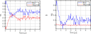

.. highlight:: matlab
.. _correctphase:

***********************
:mod:`correctphase`
***********************

Phase correction of complex-valued data

Syntax
=========================================

.. code-block:: matlab

    Vc = correctphase(V)
    Vc = correctphase(V,p)
    Vc = correctphase(V,p,oc)
    [Vc,p,io] = correctphase(V)

Parameters
    *   ``V`` - Complex-valued signal (N-array)
    *   ``ph`` - Correction phase (scalar)
    *   ``oc`` - Imaginary offset correction (boolean)
Returns
    *   ``Vc`` - Phase-corrected signal (N-array)
    *   ``ph`` - Correction phase (scalar)
    *   ``io``  - Imaginary offset (scalar)

Description
=========================================

.. code-block:: matlab

     Vc = correctphase(V)

Performs a phase correction of the complex-valued data ``V`` that minimizes the norm of the imaginary component of the data. The phase-corrected data ``Vc`` is returned normalized.

.. code-block:: matlab

     Vc = correctphase(V,ph)

Applied a phase correction with a given phase angle ``ph`` (in radians) to input data vector ``V``.

.. code-block:: matlab

    Vc = correctphase(V,p,oc)

A third boolean argument ``oc`` can be passed to enable/diasable the fitting of a possible offset on the imaginary component of the data (defaults to ``false``).

.. code-block:: matlab

    [Vc,ph,io] = correctphase(V,p,oc)

Returns, in addition to ``Vc``, the fitted or applied phase angle ``ph`` (in radians), and the fitted imaginary offset ``io``.

