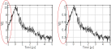

.. highlight:: matlab
.. _correctscale:

***********************
:mod:`correctscale`
***********************

Amplitude offset correction of dipolar spectroscopy signals

Syntax
=========================================

.. code-block:: matlab

    Vc = correctscale(V,t)
    [Vc,V0] = correctscale(V,t)

Parameters
    *   ``V`` - Signal (N-array)
    *   ``t`` - Time axis (N-array)
Returns
    *   ``Vc`` - Normalized signal (N-array)
    *   ``V0`` - Fitted amplitude offset (scalar)

Description
=========================================

.. code-block:: matlab

        [Vc,V0] = correctscale(V,t)

Determines the amplitude offset ``V0`` of a dipolar signal ``V`` and time axis ``t`` (in ns/us). The output signal ``Vc`` is normalized by the offset via ``Vc = V/V0``.

