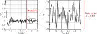

.. highlight:: matlab
.. _noiselevel:

*********************
:mod:`noiselevel`
*********************

Estimate the noise level (standard deviation) on a signal.

-----------------------------

Syntax
=========================================

.. code-block:: matlab

   Level = noiselevel(S)
   Level = noiselevel(S,M)

Parameters
    *   ``S`` - Signal vector (*N*-element array)
    *   ``M`` -  Number of points considered (scalar)
Returns
    *  Noise level (scalar)

-----------------------------

Description
=========================================
The function can be called as follows

.. code-block:: matlab

   Level = noiselevel(S)

Returns the standard deviation estimation of the noise in the signal ``S``. The estimation is done from the last quarter of the signal, i.e. ``M=3/4*N``.

-----------------------------

.. code-block:: matlab

    Level = noiselevel(S,M)

If parameter ``M`` is specified, the noise level estimation is done from the last ``M`` points of the N-point signal.

-----------------------------

Example
============

.. hint:: This function returns the estimation of the noise standard deviation (called noise level in DeerLab). This definition of noise level is used throughout DeerLab.