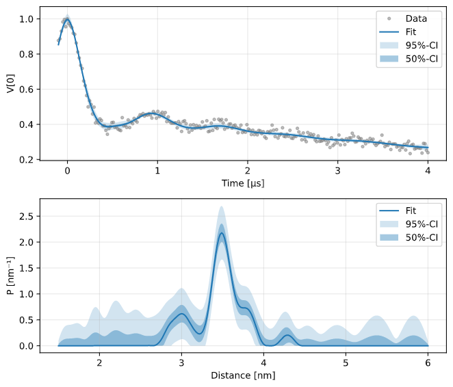

.. _beginners_guide:

Getting Started
============================================================

This is the introductory guide to DeerLab.

--------

Importing DeerLab
-------------------

DeerLab is a Python package. In order to use it, you need to import it. For this, use the import statement: ::

    import deerlab as dl

This makes DeerLab functions accessible via the abbreviated name ``dl``. For example, the function ``deerload`` can be called via ``dl.deerload``. We recommend to use ``dl`` as the standard import abbreviation for DeerLab.

--------

Importing other packages
-----------------------------

Other packages need to be imported as well. The most important one is ::

   import numpy as np                # NumPy: vectors, matrices, linear algebra
   
`NumPy <https://numpy.org/doc/stable/index.html>`_ is the fundamental package for scientific computing in Python. It is a Python library that provides multidimensional arrays (vectors, matrices, etc) and many array functions, including mathematical, logical, shape manipulation, sorting, selecting, I/O, discrete Fourier transforms, basic linear algebra, basic statistical operations, random number generators, and much more.

Most mathematical operations in DeerLab are based on Numpy, and all numerical outputs returned by DeerLab functions are Numpy data types. It is recommendable, to invest a short amount of time to familiarize yourself with some `basic Numpy concepts <https://numpy.org/doc/stable/user/basics.html>`_.

If you have experience with MATLAB, have a look at `Numpy for MATLAB users <https://numpy.org/doc/stable/user/numpy-for-matlab-users.html>`_.

Another important package is `Matplotlib <https://matplotlib.org/>`_, a library that provides plotting capabilities. It contains many modules, of which ``pyplot`` is the most important for basic plotting. Import it with ::

   import matplotlib.pyplot as plt   # Matplotlib: plotting

Python lists and NumPy arrays
---------------------------------------------------------------
In DeerLab, many functions accept Python lists, NumPy arrays, or both as inputs. While a Python list can contain different data types within a single list, all of the elements in a NumPy array (a so called ndarray) should share the same data type. For example: ::

    a = [1,2,3] # is a list-type
    b = np.array([1,2,3]) # is an ndarray-type

and the elements on such variables can be accessed by their indices in the exact same way: ::

    print(a[0]) # print the first element of the list
    print(b[2]) # print the third element of the ndarray

Note that Python is a 0-indexed language, meaning that the first element of any list, array,... is indexed with 0. 

--------

Loading Spectrometer Files
--------------------------

DeerLab provides the function ``deerload`` that can load dipolar EPR data from most spectrometer file formats. It works for 1D and 2D datasets, both real- or complex-valued.

First, determine the location of the spectrometer files you want to load and of the script or Jupyter notebook you are writing is. Let's assume that the script is called ``myscript.py`` and that the data is stored in ``DEERexperiment.DTA`` in the following folder structure: ::

    /home
     |-----experiments
     |      |
     |      |---DEERexperiment.DSC
     |      +---DEERexperiment.DTA
     |
     +-----scripts
            |
            +---myscript.py

From the location of the script, you have two ways to access the data files: using the absolute path, or using the relative path: ::

    filepath = '/home/experiments/DEERexperiment.DTA'   # absolute path
    filepath = '../../experiments/DEERexperiment.DTA'   # relative path

Call ``deerload`` with either of these two paths: ::

    t,V = dl.deerload(filepath)   # load experimental data

The function returns two outputs: the first is the time-axis of your experiment, and the second is the raw experimental data as saved by your spectrometer. Here, we store them in variables named ``t`` and ``V``.

Both ``t`` and ``V`` are 1D Numpy arrays with ``N`` elements. To load an additional file, load it into different variables: ::

    filepath1 = '/home/experiments/DEER4p_experiment.DTA'   # absolute path to 1st file
    filepath2 = '/home/experiments/DEER5p_experiment.DTA'   # absolute path to 2nd file
    t1,V2 = dl.deerload(filepath1)   # load 1st set of experimental data
    t2,V2 = dl.deerload(filepath2)   # load 2nd set of experimental data

``deerload`` attempts to return the experiment time-axis ``t`` in units of microseconds, but might not be able to do so for all file formats. For more details about ``deerload`` see the :ref:`reference documentation <deerload>`.

---------------

Pre-Processing
---------------

After loading, the experimental dipolar EPR spectroscopy data pre-processing in a series of steps:

Phase correction
    Experimental dipolar signals are most often aquired in quadrature, with the in-phase and the out-of-phase component stored as the real and the imaginary part of a complex-valued signal. The first step is to perform a phase correction which minimizes the imaginary component and maximize the real component. If the signal is not complex-valued, skip this step. The phase correction function ``correctphase`` takes the complex-valued signal and returns the real-valued phase-corrected dipolar signal: ::

        V = dl.correctphase(V)    # phase correction of experimental data

    Note that all other DeerLab functions do not behave properly or might lead to errors if the dipolar signal is complex-valued.

Zero-time correction
    In dipolar EPR spectroscopy models, we define the zero-time as that time, where the dipolar signal has its largest contribution or amplitude. In the raw data, the numerical values of time axis are often shifted relative to this due to details such as pulse lengths and time delays. The function ``correctzerotime`` takes the raw time-axis ``t`` and dipolar signal ``V`` and returns a time axis shifted such that the zero time corresponds to the signal's maximum (taking into account noise in
    the data): ::

        t = dl.correctzerotime(V,t)  # zero-time correction

In both steps, the corrections are based on optimization approaches. These work well in most cases. Should either fail for a specific case, the phase adjustment and time-axis shift can also be done manually: ::

    t = t - t0                          # manual zero-time correction 
    V = np.real(V*np.exp(-1j*phase))    # manual phase correction

All analysis and fitting functions in DeeLab assume the dipolar signals and their corresponding time-axes to be properly pre-processed.

---------------

Fitting Dipolar Signals
-----------------------

DeerLab provides a wide range of functionality to analyze experimental dipolar EPR data using least-squares fitting. The main fit function of DeerLab is ``fitmodel``. This function can fit models with either non-parametric and parametric distance distributions to the data. This fitting is done in a one-step process, such that all model parameters (e.g. distance distribution, modulation depth, background decay rate, spin concentration, etc.) are obtained at the same time. It also provides uncertainty estimates for all fitted quantities (see later).

Picking the right model
***********************

DeerLab provides a very flexible framework to model dipolar signals originating from many different dipolar EPR spectroscopy experiments. Choosing a model that properly describes your sample and experiment is of paramount importance. In ``fitmodel`` the main structure of the model is already defined, with the following components:     

* **Distance range**: Also called the distance-axis, is the range of distances where the distribution is defined. 
* **Distribution model**: Describes the intra-molecular distance distribution in either a parametric (e.g. a Gaussian distribution) or a non-parametric way. 
* **Background model**: Describes the dipolar background signal arising from the inter-molecular contributions. 
* **Experiment model**: Describes the experiment-specific shape of the dipolar signal.

For each of these four components, a choice needs to be made: 

(1) **Choose a distance range**

    The distance range :math:`[r_\mathrm{min},r_\mathrm{max}]` is an important choice, as any distance distribution is truncated to this range, i.e. :math:`P(r)=0` for:math:`r<r_\mathrm{min}` and :math:`r>r_\mathrm{max}`. The lower limit of the distance range is determined by the bandwidth of the pulses, and also by the time increment. Typically, 1.5 nm is a reasonable choice. The upper limit depends on the length of the experimental time trace and on the distances in your sample. The number of points in ``r`` is usually set equal to the number of time points. Such a distance-axis is usually defined as ``r`` is most easily defined using the ``linspace`` function from NumPy: ::

        r = np.linspace(1.5,6,len(t))  # define distance range form 1.5nm to 6nm with the same amount of points as t

(2) **Choose a distribution model**

    A non-parametric distribution is specified using the string ``'P'`` in ``fitmodel``. In a non-parametric distribution, each element :math:`P_i` of the distribution is a parameter. Non-parametric distributions are obtained via methods such as Tikhonov regularization. If there are reasons to believe that the distance distribution has a specific shape (e.g. Gaussian, Rice, random-coil, etc.), or if there is very little information in the data, use a parametric distance distribution model from the :ref:`list of available models<modelsref_dd>`. If a sample does not have a intra-molecular distance distribution (if there are no doubly labelled molecules), set the distribution model to ``None``.

(3) **Choose a background model**

    Typically, a background model of a homogenous 3D distribution of spins is appropriate. The associated parametric model function is :ref:`bg_hom3d`. In some cases, depending on the properties of your sample, other background models might be needed, such as backgrounds arising from distributions of spins in fractal dimensions or when  accounting for volume-exclusion effects. In such cases, use the associated parametric background models from the :ref:`list of available models<modelsref_bg>`. If there is no inter-molecular background in your sample, or it is negligible, set the background model to ``None``.

(4) **Choose an experiment model**

    This decision should be based on the experiment you used to acquire the data. In the case of 4-pulse DEER data, when analyzing a standard 4-pulse DEER signal without 2+1 component at the end, use :ref:`ex_4pdeer`. If the 2+1 component (appearing at the right edge of the time trace) should be fitted as well, use the :ref:`ex_ovl4pdeer` model. There are experiment models for more complicated signals, such as 5-pulse DEER or 7-pulse DEER. Use the associated parametric experiment models from the :ref:`list of available models<modelsref_ex>`. If you want to model simple dipolar oscillations without any additional effects (modulation depth, secondary pathways), set the experiment model to ``None``.

Here is a list of examples with different situations and what the proper choices of model are: 

=========================================================================== ==================== ================== ==================
            Description                                                      Distribution model   Background model   Experiment model
=========================================================================== ==================== ================== ==================
4pDEER signal with non-parametric distribution and homogenous 3D background   ``'P'``             ``bg_hom3d``       ``ex_4pdeer``
4pDEER signal with Gaussian distribution amd homogenous 3D background         ``dd_gauss``        ``bg_hom3d``       ``ex_4pdeer``
Dipolar evolution function with a random-coil distribution                    ``dd_randcoil``     ``None``           ``None``
4pDEER signal with non-parametric distribution and no background              ``'P'``             ``None``           ``ex_4pdeer``
5pDEER signal with non-parametric distribution and fractal background         ``'P'``             ``bg_homfractal``  ``ex_5pdeer``
=========================================================================== ==================== ================== ==================

Starting the fit
*****************
Next, the fit can be started by calling ``fitmodel`` with the chosen model. The function takes several inputs: the experimental dipolar signal ``V`` and its time-axis ``t``, followed by all four model components described above: the distance-axis ``r``, the distribution model, the background model, and the experiment model.

The models that have an associated parametric function, e.g. ``bg_hom3d``, must be passed directly as inputs to ``fitmodel``. In Python, functions can be passed as inputs to other functions. 

For example, a 4pDEER signal with non-parametiric distribution and homogenous 3D background can be fitted using ::

    fit = dl.fitmodel(V,t,r,'P',dl.bg_hom3d,dl.ex_4pdeer)  # 4pDEER fit

For the other examples in the table above, the call to ``fitmodel`` would look like this

=========================================================================== ================================================================
            Description                                                        Fit
=========================================================================== ================================================================
4pDEER signal with non-parametric distribution and homogenous 3D background  ``fit = dl.fitmodel(V,t,r,'P',dl.bg_hom3d,dl.ex_4pdeer)``
4pDEER signal with Gaussian distribution and homogenous 3D background        ``fit = dl.fitmodel(V,t,r,dl.gauss,dl.bg_hom3d,dl.ex_4pdeer)``
Dipolar evolution function with a random-coil distribution                   ``fit = dl.fitmodel(V,t,r,dl.randcoil,None,None)``
4pDEER signal with non-parametric distribution and no background             ``fit = dl.fitmodel(V,t,r,'P',None,dl.ex_4pdeer)``
5pDEER signal with non-parametric distribution and fractal background        ``fit = dl.fitmodel(V,t,r,'P',dl.bg_homfractal,dl.ex_5pdeer)``
=========================================================================== ================================================================

``fitmodel`` uses a least-squares fitting algorithm to determine the optimal distance distribution, background parameters, and experiment parameters that fit the experiment data. To determine the non-parametric distribution, it internally uses Tikhnonov regularization with a regularization parameter optimized using the Akaike Information Criterion (AIC). All settings related to the fit can be adjusted by using the appropriate keywords, see the :ref:`reference documentation <fitmodel>` for details. For example, the regularization parameter used in the Tikhonov regularization could be manually adjusted by using the ``regparam`` keyword: ::

    fit = dl.fitmodel(V,t,r,'P',dl.bg_hom3d,dl.ex_4pdeer, regparam='aic') # regularization with Akaike information criterion
    fit = dl.fitmodel(V,t,r,'P',dl.bg_hom3d,dl.ex_4pdeer, regparam='gcv') # regularization with Generalized Cross-Validation
    fit = dl.fitmodel(V,t,r,'P',dl.bg_hom3d,dl.ex_4pdeer, regparam=0.05)  # regularization with fixed regularization parameter

After ``fitmodel`` has found a solution, it returns an object that we assigned to ``fit``. This object contains fields with all quantities of interest with the fit results, such as the fitted model, goodness-of-fit statistics, and uncertainty information. See the :ref:`reference <fitmodel>` for ``fitmodel``  for a detailed list of these quantities.

Displaying the results
**********************

For just a quick display of the results, you can use the ``plot()`` method of the ``fit`` object that will display a figure with you experimental data, the corresponding fit, and the fitted distance distribution including confidence bands. :: 

    fit.plot() # display results

These confidence bands are covariance-based and might represent an overestimation of the true uncertainty on the results (see :ref:`uncertainty <uncertainty>` for further details). It is important to always report confidence bands with fitted distance distributions.

The ``fit`` output contains additional information, for example:

    * ``fit.V``, ``fit.B``, and ``fit.P`` contain the arrays of the fitted dipolar signal, background, and distance distribution, respectively. 
    * ``fit.exparam``, ``fit.bgparam``, and ``fit.ddparam`` contain the arrays of fitted model parameters for the experiment, background, and distribution models. 
    * ``fit.scale`` contains the fitted overall scale of the dipolar signal.

In addition to the distance distribution fit, it is important to check and report the fitted model parameters and their uncertainties. While this can be computed manually, a summary can be easily requested by enabling the ``verbose`` option of ``fitmodel``. By using ::

    fit = dl.fitmodel(V,t,r,'P',dl.bg_hom3d,dl.ex_4pdeer,verbose=True)  # 4pDEER fit and report parameter fits

after the function has fitted your data, it will print a summary the results, including goodness-of-fit estimators
and fitted parameters with uncertainties. Here is an example output

.. code-block:: text

    -----------------------------------------------------------------------------------------
    Goodness of fit
    Vexp[0]: 𝛘2 = 25.510184  RMSD  = 1.953580e+07
    -----------------------------------------------------------------------------------------
    Fitted parameters and 95%-confidence intervals
    Vfit[0]:
    V0:  3.551e+07  Signal scale (arb.u.)
    bgparam[0]:   145.3121342  (111.0809911, 179.5432773)  Concentration of pumped spins (μM)
    exparam[0]:   0.4066627  (0.3630338, 0.4502916)  Modulation depth ()
    -----------------------------------------------------------------------------------------

where there are no distribution parameters (``ddparam``) due to the distribution model being non-parametric. 

Exporting the figure and the data
*********************************

After completing the fit, you might want to export the figure with the fit. Here is one way to do it: ::

    figure = fit.plot()                       # get figure object
    figure.savefig('DEERFig.png', dpi=600)    # save figure as png file
    figure.savefig('DEERFig.pdf')             # save figure as pdf file

To export the fitted distance distribution for plotting with another software, save it in a simple text file ::

    np.savetxt('distancedistribution.txt', np.asarray((r, fit.P, *fit.Puncert.ci(95).T)).T)

The generated file contain four columns: the distance axis, the distance distributions, and the upper and lower confidence bounds. The ``.T`` indicate array transposes, which are used to get the confidence bands into the column format for saving.

To export the fitted time-domain trace, use similarly ::

    np.savetxt('timetrace.txt', np.asarray((t, V, fit.V, *fit.Vuncert.ci(95).T)).T)

------------

Summary
--------

Here is an example script to load experimental time trace, pre-process it, and fit a 4-pulse DEER model with a non-parametric distance distribution:  ::

    import numpy as np
    import deerlab as dl

    # Data import
    filepath = '/home/experiments/DEERexperiment.DTA'  # file path
    t,V = dl.deerload(filepath)   # load experimental data

    # Pre-processing
    V = dl.correctphase(V)   # phase correction 
    t = dl.correctzerotime(V,t)   # zero-time shift

    # Distance range
    r = np.linspace(1.5,6,len(t))   # define distance range from 1.5nm to 6nm with the same number of points as t

    # Fit
    fit = dl.fitmodel(V,t,r,'P',dl.bg_hom3d,dl.ex_4pdeer,verbose=True)   # 4pDEER fit using non-parametric distance distribution
    fit.plot() # display results
    
    # Print figure
    figure = fit.plot()
    figure.savefig('DEERfig.pdf')
