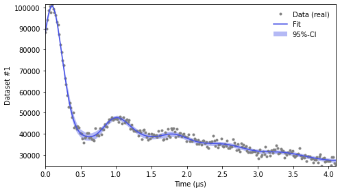

.. _beginners_guide:

Beginners Tutorial
============================================================

This is the DeerLab guide for beginner’s. If you have comments or suggestions, please don’t hesitate to reach out!

--------

Installing DeerLab
-------------------
To install DeerLab, you need a valid Python installation on your computer. You can download it from the `official Python website <https://www.python.org/>`_ There are many useful and thorough tutorials out there to guide 
you through the installation and setup (see `here <https://realpython.com/installing-python/>`_ for example). Make sure you install one of the compatible Python versions listed :ref:`here <installation>`.

If you have Python installed you can download and install DeerLab with: ::

    pip install deerlab

If you want more detailed instructions for installing DeerLab on your operating system, you can :ref:`find all details here <installation>`.

--------

Importing DeerLab
-------------------

Everytime you want to use a package, library, or module in your code or script, you first need to make it accessible.
In order to start using all the functions available in DeerLab, you need to import it. This can be easily done with this import statement: ::

    import deerlab as dl

We usually shorten DeerLab as ``dl`` in order to keep the code standarized so that everybody knows that these are DeerLab functions by
looking at your code, it also shortens the amount of text you need to type. 

--------

Getting to know Numpy
----------------------

`NumPy <https://numpy.org/doc/stable/index.html>`_ is the fundamental package for scientific computing in Python. It is a Python library 
that provides a multidimensional array object, various derived objects (such as masked arrays and matrices), and an 
assortment of routines for fast operations on arrays, including mathematical, logical, shape manipulation, sorting, selecting, I/O, 
discrete Fourier transforms, basic linear algebra, basic statistical operations,
random simulation and much more.

Most mathemtical operations in DeerLab are based on Numpy, and all numerical outputs returned by DeerLab functions are Numpy data types.
It is recommendable, to invest a short amount of time to familiarize yourself 
with some `basic Numpy concepts <https://numpy.org/doc/stable/user/basics.html>`_.

On the other hand, if you have previously worked with the MATLAB, here is a good guide of 
`Numpy for MATLAB users <https://numpy.org/doc/stable/user/numpy-for-matlab-users.html>`_.

What’s the difference between a Python list and a NumPy array?
---------------------------------------------------------------
In DeerLab, you will notice that many functions take lists, NumPy-arrays or both as inputs. While a Python list can contain different data
types within a single list, all of the elements in a NumPy array (a so called ndarray) should share the same data type. For example: ::

    a = [1,2,3] # is a list-type
    b = np.array([1,2,3]) # is an ndarray-type

and the elements on such variables can be accessed by their indices in the exact same way: ::

    print(a[0]) # print the first element of the list
    print(b[2]) # print the third element of the ndarray

Note that Python is a 0-indexed language, meaning that the first element of any list, array,... is indexed with 0. 

--------

Loading Spectrometer Files
--------------------------

Dipolar EPR spectroscopy experiments, saved at the spectrometers, come in a variety of spectrometer-specific formats.  DeerLab provides a 
function ``deerload`` that can read most spectrometer formats, can read both 1D and 2D datasets, both real- or complex-valued. If you are familiar 
with the Easyspin package, ``deerload`` is equivalent to the load function ``eprload`` of that package.  

First, you need to locate the spectrometer files you want to load and where the script you are writing is. Let's assume that your script is called ``myscript.py`` 
and that you experiment data is called ``DEERexperiment.DTA`` and you directories look like this: ::

    home
     |-----experiments
     |      |
     |      |---DEERexperiment.DSC
     |      +---DEERexperiment.DTA
     |
     +-----scripts
            |
            +---myscript.py

From the perspective of your script, you have two ways to reference the data files: using absolute or relative paths, in the example above: ::

    filepath = '/home/experiments/DEERexperiment.DTA'   # absolute path
    filepath = '../../experiments/DEERexperiment.DTA'   # relative path

Then you just need to call ``deerload`` and specify the path of the file. If you look into the :ref:`reference documentation <deerload>`
for ``deerload`` you will see that the function returns two output variables: the first one ``t`` is the time-axis of your experiment, and the second one
``V`` is the raw experimental data as exported by your spectrometer. ::

    t,V = dl.deerload(filepath)   # load experimental data

Both ``t`` and ``V`` will be returned as (at least) 1D-Numpy arrays with ``N`` elements. If you need or want to load more than one dataset, you
just need to specify the path of the other file and load them into different variables: ::

    filepath1 = '/home/experiments/DEER4p_experiment.DTA'   # absolute path to 1st file
    filepath2 = '/home/experiments/DEER5p_experiment.DTA'   # absolute path to 2nd file
    t1,V2 = dl.deerload(filepath1)   # load 1st set of experimental data
    t2,V2 = dl.deerload(filepath2)   # load 2nd set of experimental data

Note that ``deerload`` attempts to return the experiment time-axis ``t`` in the correct units (microseconds), but might not be able to do so for all file formats.

---------------

Pre-Processing
---------------

Raw experimental dipolar EPR spectroscopy data comes in a crude state and must be undergo a series of pre-processing steps prior to any fitting.

Phase correction
    Experimental dipolar signals are usually complex, the first step if to perform a phase correction which will minimize the imaginary component and maximize the real component. 
    If the signal is not complex-valued this step can be omited. The phase correction function ``correctphase`` takes the complex-valued dipolar signal, and returns the real-valued
    dipolar signal, whose real-part has been optimized: ::

        V = dl.correctphase(V)  # phase correction of experimental data

    It is important to note that all other DeerLab functions do not behave properly or might lead to errors if the dipolar signal is
    complex-valued. 

Zero-time correction
    Dependending on the file format and the spectrometer, the values of the experiment time-axis might be defined differently. Frequently, in commercial spectrometers these are defined
    as absolute timings, with the zero-time corresponding to the first element ``t[0]=0``. In dipolar EPR spectroscopy models, we define the zero-time as that time, where the dipolar 
    signal has its largest contribution or amplitude. 
    The function ``correctzerotime`` takes the time-axis ``t`` and dipolar signal ``V`` and optimizes the timing that corresponds to the signal's maximum (taking into account noise in
    the data). The function returns the time-axis with the correct zero-time: ::

        t = dl.correctzerotime(V,t)  # zero-time correction

    Note that the zero-time can technically be fitted if included as a model parameter. However, this requires much more expertise with DeerLab and its theoretical principles. 

In both cases, the corrections are based on optimization approaches. Should that fail for a specific case, the phase and zero-time needed for correction can also be manually specified. 
See the documentation for :ref:`correctphase` and :ref:`correctzerotime`.

Note that all analysis functions in DeeLab assume the dipolar signals and their corresponding time-axes to be properly pre-processed.  

---------------

Fitting Dipolar Signals
-----------------------

DeerLab provides a wide range of functionality to analyze experimental dipolar EPR data using least-squares fitting. While there are multiple analysis functions of varying application, 
generality and difficulty, the main fit function of DeerLab is ``fitsignal``. This function can fit non-parametric and parametric distance distributions, and all model parameters 
(e.g. modulation depth, background decay rate, spin concentration, etc.) in a one-step analysis. It also provides uncertainty estimates for all fitted quantities (see later).

Picking the right model
***********************

DeerLab provides a very flexible framework to model dipolar signals originating from many different dipolar EPR spectroscopy experiments. Choosing a model that properly describes your 
is of paramount importance. In ``fitsignal`` the main structure of the model is already defined, and the decision is divided into four decisions that define the model: 
    * **Distance range**: Also called the distance-axis, is the range of distances where the distribution is defined. 
    * **Distribution model**: Describes the distance distributions in a parametric (e.g. a Gaussian distribution) or non-parametric way. 
    * **Background model**: Describes the dipolar background arising from the inter-molecular contributions during an experiment. 
    * **Experiment model**: Describes specific properties of a dipolar signal that are dependent on the experiment used to acquire the data.

Now you must decide for a model. As described above, there are four separate choices to take 

(1) **Choosing a distance range**

    The distance range :math:`[r_\mathrm{min},r_\mathrm{max}]` is an important choice, as any distance distibution is truncated to this range, i.e. :math:`P(r)=0` for
    :math:`r<r_\mathrm{min}` and :math:`r>r_\mathrm{max}`. The lower limit of the distance range is determined by the bandwidth of the pulses, and also on the time increment. 
    Typically, 1.5 nm is a reasonable choice. The upper limit depends on the length of the experimental time trace and on the distances in your sample. The number of points 
    in ``r`` is usually set equal to the number of time points. Such a distance-axis is usually defined as ``r`` is most easily defined using the ``linspace`` function from NumPy: ::

        r = np.linspace(1.5,6,len(t))  # define distance range form 1.5nm to 6nm with the same amount of points as t

(2) **Choosing a distribution model**

    Generally, a non-parametric distribution is preferred (specified using the string ``'P'`` in ``fitsignal``), i.e. a distribution where each element :math:`P_i` of the distribution is a parameter. 
    Non-parametric distributions are obtained via methods such as Tikhonov regularization. If there are reasons to believe that the distance distribution has a 
    specific shape (e.g. Gaussian, Rice, random-coil, etc.), use the associated parametric distance distibution model from the :ref:`list of available models<modelsref_dd>`.

(3) **Choosing a background model**

    Typically, a background arising from a homogenous 3D-distribution of spins is sufficient. The associated parametric model function is :ref:`bg_hom3d`. In some cases, depending on 
    the properties of your sample, other background models might be needed could be needed, such as background arising from distributions of spins in fractal dimensions or when
    accounting for volume-exclusion effects. In such cases, use the associated parametric background models from the :ref:`list of available models<modelsref_bg>`.

(4) **Choosing an experiment model**

    This decision should be based on the experiment you used to acquire the data. In the case of 4-pulse DEER data, when analyzing a standard 4-pulse DEER signal without 2+1 component
    at the end, use :ref:`ex_4pdeer`. If the 2+1 components should be fitted as well, use the :ref:`ex_ovl4pdeer` model. There are :experiment models for more complicated signals, such 
    as 5-pulse DEER or 7-pulse DEER. Use the associated parametric experiment models from the :ref:`list of available models<modelsref_ex>`.

When your model does not have one of the these components, i.e. no background, no foreground, etc. the corresponding submodels can be set to ``None`` to specify the choice. 

Here is a list of examples with different situations and what the proper choices of model are: 

=========================================================================== ==================== ================== ==================
            Description                                                      Distribution model   Background model   Experiment model
=========================================================================== ==================== ================== ==================
4pDEER signal with homogenous 3D background and non-parametric distribution   ``'P'``             ``bg_hom3d``       ``ex_4pdeer``
4pDEER signal with homogenous 3D background and Gaussian distribution         ``dd_gauss``        ``bg_hom3d``       ``ex_4pdeer``
Dipolar evolution function with a random-coil distribution                    ``dd_randcoil``     ``None``           ``None``
4pDEER signal with no background and non-parametric distribution              ``'P'``             ``None``           ``ex_4pdeer``
5pDEER signal with fractal background and non-parametric distribution         ``'P'``             ``bg_homfractal``  ``ex_5pdeer``
=========================================================================== ==================== ================== ==================

Starting the fit
*****************

Once you have chosen your model, you need to specify it to ``fitsignal``. The function takes several inputs: the experimental dipolar signal ``V`` and its time=axis ``t``, followed by all four 
model components described above, distance-axis ``r`` the distribution, background and experiment models. 

The models that have an associated parametric function, e.g. ``bg_hom3d``, must be passed directly as inputs to ``fitsignal``. In Python functions are treated as common numerical variables in that 
they can be passed as inputs to other functions. 

For example, a 4pDEER signal with homogenous 3D background and Tikhonov regularization can be fitted via ::

    fit = dl.fitsignal(V,t,r,'P',dl.bg_hom3d,dl.ex_4pdeer)  # 4pDEER fit

For the other examples in the table above, the call to ``fitsignal`` would look like this

=========================================================================== ================================================================
            Description                                                        Fit
=========================================================================== ================================================================
4pDEER signal with homogenous 3D background and non-parametric distribution  ``fit = dl.fitsignal(V,t,r,'P',dl.bg_hom3d,dl.ex_4pdeer)``
4pDEER signal with homogenous 3D background and Gaussian distribution        ``fit = dl.fitsignal(V,t,r,dl.gauss,dl.bg_hom3d,dl.ex_4pdeer)``
Dipolar evolution function with a random-coil distribution                   ``fit = dl.fitsignal(V,t,r,dl.randcoil,None,None)``
4pDEER signal with no background and non-parametric distribution             ``fit = dl.fitsignal(V,t,r,'P',None,dl.ex_4pdeer)``
5pDEER signal with fractal background and non-parametric distribution        ``fit = dl.fitsignal(V,t,r,'P',dl.bg_homfractal,dl.ex_5pdeer)``
=========================================================================== ================================================================

fitsignal uses a least-squares fitting algorithm to determine the optimal distance distribution, background parameters, and experiment parameters that fit the experiment data. To determine the non-parametric 
distribution, it internally uses Tikhnonov regularization with a regularization parameter optimized using the Akaike Information Criterion (AIC). All settings related to the fit can be adjusted by using the 
appropiate keywords, see the :ref:`reference documentation <fitsignal>` for details. For example, the regularization parameter used in the Tikhonov regularization could be manually adjusted by using the ``regparam``
keyword: ::

    fit1 = dl.fitsignal(V,t,r,'P',dl.bg_hom3d,dl.ex_4pdeer, regparam='aic') # regularization with Akaike information criterion
    fit2 = dl.fitsignal(V,t,r,'P',dl.bg_hom3d,dl.ex_4pdeer, regparam='gcv') # regularization with Generalized Cross-Validation
    fit3 = dl.fitsignal(V,t,r,'P',dl.bg_hom3d,dl.ex_4pdeer, regparam=0.05)  # regularization with fixed regularizaton parameter

After the function has found a solution if will return a variable ``fit``. This fit is an object with different fields containing all quantities of interest with the fit results.
A detailed list of these quantities can be found again in the :ref:`reference` for ``fitsignal``.

Displaying the results
**********************

For just a quick display of the results, you can use the ``plot()`` method of the ``fit`` object that will display a figure with you experimental data, the corresponding fit, and the fit of the distance distributon
including confidence bands. :: 

    fit.plot() # display results

It is important to note that these confidence bands are covariance-based and might represent an overestimation of the true uncertainty on the results (see :ref:`uncertainty` for further details). These bands indicate
regions in which the true values might be contained with a certain probability. It is important to always report fitted distance distributions with confidence bands. 

The ``fit`` output contains some interesting information as well, for example:

    * ``fit.V``, ``fit.B``, and ``fit.P`` contain the arrays of the fitted dipolar signal, background and distance distribution, respectively. 
    * ``fit.exparam``, ``fit.bgparam``, and ``fit.ddparam`` contain the arrays of fitted model parameters for each of the experiment, background and distribution models. 
    * ``fit.scale`` contains the fitted arbitrary scale of the dipolar signal. 

In addition to the distance distribution fit, it is important to check and report the fitted model parameters and their uncertainties. While this can be computed manually, a summary can be easily requested by enabling the 
``verbose`` option of ``fitsignal``. By using ::

    fit = dl.fitsignal(V,t,r,'P',dl.bg_hom3d,dl.ex_4pdeer,verbose=True)  # 4pDEER fit and report parameter fits

after the function has fitted your data, it will print a summary the results, including goodness-of-fit estimators
and fitted parameters with uncertainties, for example

.. code-block:: text

    -----------------------------------------------------------------------------------
    Goodness of fit
    Vexp[0]: chi2 = 1.008066  RMSD  = 0.019209
    -----------------------------------------------------------------------------------
    Fitted parameters and 95%-confidence intervals
    Vfit[0]:
    bgparam[0]:   292.02402  (230.33576, 353.71227)  Concentration of pumped spins (μM)
    exparam[0]:   0.5097663  (0.4809968, 0.5385358)  Modulation depth ()
    -----------------------------------------------------------------------------------

------------

Summary
--------

Summarizing, this would be an example script to load experimental data, pre-process the signal, and fit a 4-pulse DEER model with a non-parametric distance distribution:  ::

    # Data import
    filepath = '/home/experiments/DEERexperiment.DTA'  # file path
    t,V = dl.deerload(filepath)   # load experimental data

    # Pre-processing
    V = dl.correctphase(V)   # phase correction of experimental data
    t = dl.correctzerotime(V,t)   # zero-time correction

    # Distance range
    r = np.linspace(1.5,6,len(t))   # define distance range form 1.5nm to 6nm with the same amount of points as t

    # Fit
    fit = dl.fitsignal(V,t,r,'P',dl.bg_hom3d,dl.ex_4pdeer,verbose=True)   # 4pDEER fit
    fit.plot() # display results
