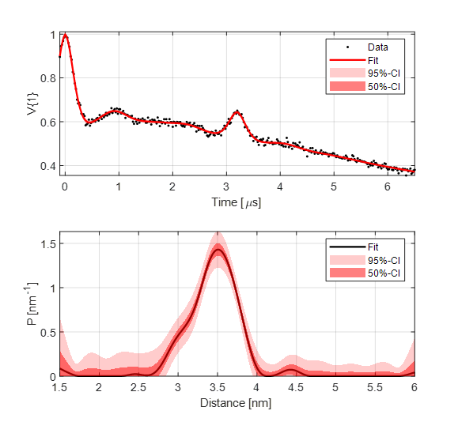

.. highlight:: python
.. _example_basic_5pdeer:

**********************************************************************************
Fitting a 5-pulse DEER signal with a parameter-free distribution
**********************************************************************************

**Script:**

.. literalinclude:: ../../../examples/DL_fitting_5pdeer.m

**Output:**

.. code-block:: none

        Goodness of fit
          V{1}: χ2 = 1.0123  RMSD  = 0.0094 
        Fitted parameters and 95%-confidence intervals
          bg{1}(1):   297.5259649  (286.4635536, 308.5883762)  Spin concentration (uM)
          ex{1}(1):   2.6975348  (2.6715264, 2.7235432)  Amplitude of unmodulated components (  )
          ex{1}(2):   1.3546653  (1.3103678, 1.3989627)  Amplitude of 1st modulated pathway (  )
          ex{1}(3):   0.4558931  (0.4250524, 0.4867339)  Amplitude of 2nd modulated pathway (  )
          ex{1}(4):   3.2012776  (3.1870567, 3.2154986)  Refocusing time of 2nd modulated pathway (us)

