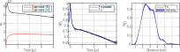

.. highlight:: matlab
.. _example_basicvalidation:

****************************************************
Experimental signal processing with validation
****************************************************

.. code-block:: matlab

    %================================================================
    % DeerAnalyis2
    % Example: Experimental data processing and validation
    %================================================================

    clear,clc,clf

    %Preparation
    %----------------------------------------------
    %Load experimental data
    [traw,Vraw] = deerload('deer_broad_50K_4us');
    traw = traw/1000; %ns->us
    %Use a reduced distance axis length to speed-up processing
    r = linspace(0.5,7,100);

    %Pre-processing
    %----------------------------------------------
    V = correctphase(Vraw);
    V = real(V);
    t = correctzerotime(V,traw);
    V = correctoffset(V,t);

    %Processing
    %----------------------------------------------
    %Fit background
    [B,lambda] = fitbackground(V,t,@td_strexp);
    %Prepare regularization
    K = dipolarkernel(t,r,lambda,B);
    L = regoperator(r,2);
    alpha = selregparam(V,K,L,'tikh','aic');
    %Run fitting
    Pfit = fitregmodel(V,K,r,L,'tikhonov',alpha);
    %Transform to time-domain
    Vfit = K*Pfit;

    %Sensitivity analysis
    %----------------------------------------------
    %Define validation parameters
    valpar.tstart = linspace(0.5,1.5,10); %us
    valpar.selmethod = {'aic','bic','aicc'};
    %Run validation
    valFcn = @(valpar)myvalidation(valpar,V,t,r);
    [Pmean,Pstd] = validate(valFcn,valpar);

    %Plotting
    %----------------------------------------------
    subplot(131)
    plot(traw,real(Vraw),'k',traw,imag(Vraw),'r','LineWidth',1)
    box on, grid on, axis tight
    xlabel('Time [\mus]')
    ylabel('V(t)')
    legend('Experimental (Re)','Experimental (Im)')
    subplot(132)
    plot(t,V,'k',t,Vfit,'b','LineWidth',1)
    box on, grid on, axis tight
    xlabel('Time [\mus]')
    ylabel('V(t)')
    legend('Pre-processed','Fit')
    subplot(133)
    hold on
    plot(r,Pfit,'k','LineWidth',1)
    f = fill([r fliplr(r)] ,[Pfit.'+Pstd.' max(fliplr(Pfit.'-Pstd.'),0)],...
        'b','LineStyle','none');
    f.FaceAlpha = 0.5;
    box on, grid on, axis tight
    xlabel('Distance [nm]')
    ylabel('P(r)')
    legend('Fit','Uncertainty')
    axis tight

    %Validation function
    %----------------------------------------------
    function Pfit = myvalidation(valpar,V,t,r)

    tstart = valpar.tstart;
    %Fit background
    [B,lambda] = fitbackground(V,t,@td_strexp,tstart);
    %Prepare regularization
    K = dipolarkernel(t,r,lambda,B);
    L = regoperator(r,2);
    method = valpar.selmethod;
    alpha = selregparam(V,K,L,'tikh',method);
    %Run fitting
    Pfit = fitregmodel(V,K,r,L,'tikhonov',alpha);

    end

