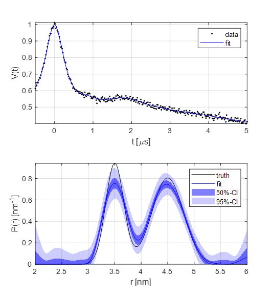

.. highlight:: matlab
.. _example_customkernel_snlls:

***************************************************************************************
Fitting a custom kernel model with a parameter-free distribution
***************************************************************************************

**Script:**

.. literalinclude:: ../../../examples/DL_customkernel_snlls.m

**Output:**

