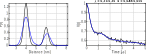

.. highlight:: matlab
.. _example_pararegcombination:

****************************************************
Synchronous background and regularization fitting
****************************************************

.. code-block:: matlab

    %================================================================
    % DeerAnalyis2
    % Example: Paramteric mode fitting & Regularization combination
    % Perform simulatenous parametric model fitting of the background
    % and Tikhonov regularization for a one-step analysis of the data
    %================================================================

    clear,clc,clf

    %Preparation
    %----------------------------------------------
    t = linspace(-1,5,200);
    r = time2dist(t);
    P = rd_twogaussian(r,[6 0.3 4 0.3 0.3]);
    trueparam = [0.3 0.15];

    %Construct exponential background
    B = td_exp(t,[trueparam(2)]);

    %Generate signal
    V = dipolarsignal(t,r,P,'ModDepth',trueparam(1),'Background',B,'Noiselevel',0.01);

    %Fitting
    %----------------------------------------------

    %Create function handle depending on r and param from the custom model
    fcnhandle = @(t,param)myfitting(t,param,r,V);

    %Initial guess
    param0 = [0.4,0.2];

    %Launch the fitting of the B-parametric model + Tikhonov regularization
    [~,parafit] = fitparamodel(V,fcnhandle,t,param0,...
                               'Lower',[0 0],'Upper',[1 10],...
                               'TolFun',1e-3);

    %Obtain the fitted signal and distance distribution
    [Vfit,Pfit] = myfitting(t,parafit,r,V);

    %Plot results
    %----------------------------------------------
    subplot(121)
    plot(r,P,'k',r,Pfit,'b','LineWidth',1.5)
    box on, grid on, axis tight
    xlabel('Distance [nm]')
    ylabel('P(r)')

    subplot(122)
    plot(t,V,'k',t,Vfit,'b','LineWidth',1.5)
    xlabel('Time [\mus]')
    ylabel('V(t)')
    title(sprintf('\\lambda = %.2f/%.2f  k = %.3f/%.3f',...
            parafit(1),trueparam(1),parafit(2),trueparam(2)))
        box on, grid on, axis tight

    %Definition of the custom model
    %----------------------------------------------

    function [Vfit,Pfit] = myfitting(t,param,r,V)

        %Fit the modulation depth as first parameter...
        lambda = param(1);
        %... and the decay rate of the background as second parameter
        Bfit = td_exp(t,param(2));
        %Construct a kernel with the fitted background
        K = dipolarkernel(t,r,lambda,Bfit);
        %Prepare regularization
        L = regoperator(length(V),2);
        alpha = selregparam(V,K,L,'tikh','aic');
        %Regularize the data using the fitted backgorund
        Pfit = fitregmodel(V,K,r,L,'tikhonov',alpha);
        %Get the signal for comparison in time-domain
        Vfit = K*Pfit;
        plot(t,V,t,Vfit),drawnow
    end

