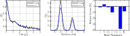

.. highlight:: matlab
.. _example_timedomainfitting:

*****************************************
Parametric time-domain model fitting
*****************************************

.. code-block:: matlab

    %========================================================
    % DeerAnalyis2
    % Example: Time-domain parametric model fitting
    % Construct the a time-domain model of the DEER signal
    % including background and fit distribution+background at
    % the same time.
    %========================================================

    clear,clc

    %Preparation
    %----------------------------------------------
    t = linspace(0,5,100);
    r = time2dist(t);
    K = dipolarkernel(t,r);
    P = rd_twogaussian(r,[6 0.3 4 0.3 0.3]);
    B = td_exp(t,[0.05]);
    %Generate signal
    V = dipolarsignal(t,r,P,'ModDepth',0.3,'Background',B,'Noiselevel',0.01);
    trueparam = [0.3 0.05 6 0.3 4 0.3 0.3];

    %Parametric model
    %----------------------------------------------
    %Construct time-domain model function including background
    mysignal = @(t,param) td_exp(t,param(2)).*((1 - param(1)) + param(1)*K*rd_twogaussian(r,param(3:end)));

    %Define lower/upper bounds and initial guess of parameters
    upper = [1 200 20 5 20 5 1];
    lower = [0 0 1.0 0.05 1.0 0.05 0];
    param0 = [0.5 0.35 3.5 0.4 6 0.2 0.4];

    %Convert model function to valid parametric model
    model = paramodel(mysignal,param0,lower,upper);

    %Fit the parametric model in time-domain
    %----------------------------------------------
    [param,fit] = fitparamodel(V,mysignal,t,param0,'Upper',upper,'Lower',lower);
    Pfit = rd_twogaussian(r,param(3:end));
    Pfit = Pfit/sum(Pfit)/mean(diff(r));

    %Plot
    %----------------------------------------------
    figure(1),clf
    subplot(131)
    plot(t,V,'k',t,fit,'b','LineWidth',1.5)
    xlabel('Time [\mus]')
    ylabel('V(t)')
    grid on,axis tight, box on
    legend('Truth','Fit')

    subplot(132)
    plot(r,P,'k',r,Pfit,'b','LineWidth',1.5);
    xlabel('Distance [nm]')
    ylabel('P(r)')
    grid on,axis tight, box on
    legend('Truth','Fit')

    subplot(133)
    %Correct label switch
    temp = param(3:4);
    param(3:4) = param(5:6);
    param(5:6) = temp;
    param(end) = 1 - param(end);
    %Plot
    bar(100*(1 - param./trueparam),'b')
    tags = {'\lambda','k','<r_1>','\sigma_1','<r_2>','\sigma_2','A_1',};
    set(gca,'xticklabel',tags)
    xlabel('Model Parameters')
    ylabel('Relative fit error [%]')

