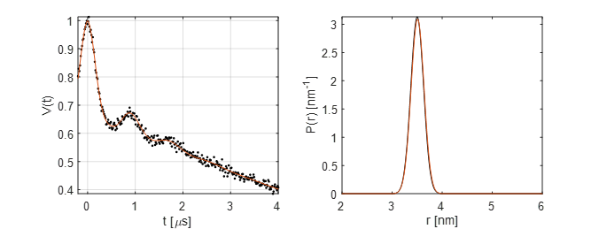

.. highlight:: matlab
.. _example_timedomainfitting:

**********************************************************************************
Fitting a custom time-domain model of a 4-pulse DEER signal
**********************************************************************************

**Script:**

.. literalinclude:: ../../../examples/DL_custom_timedomain_model.m

**Output:**

