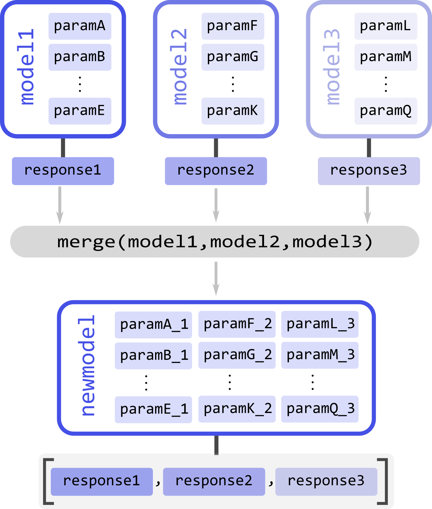
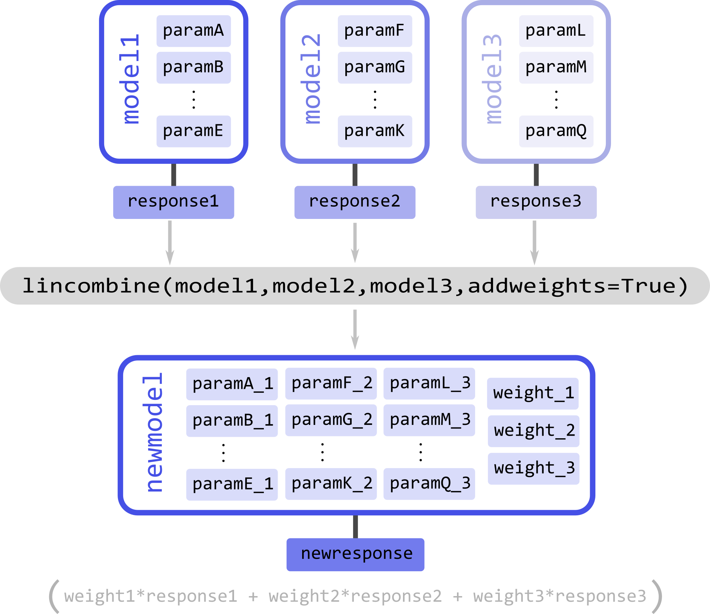
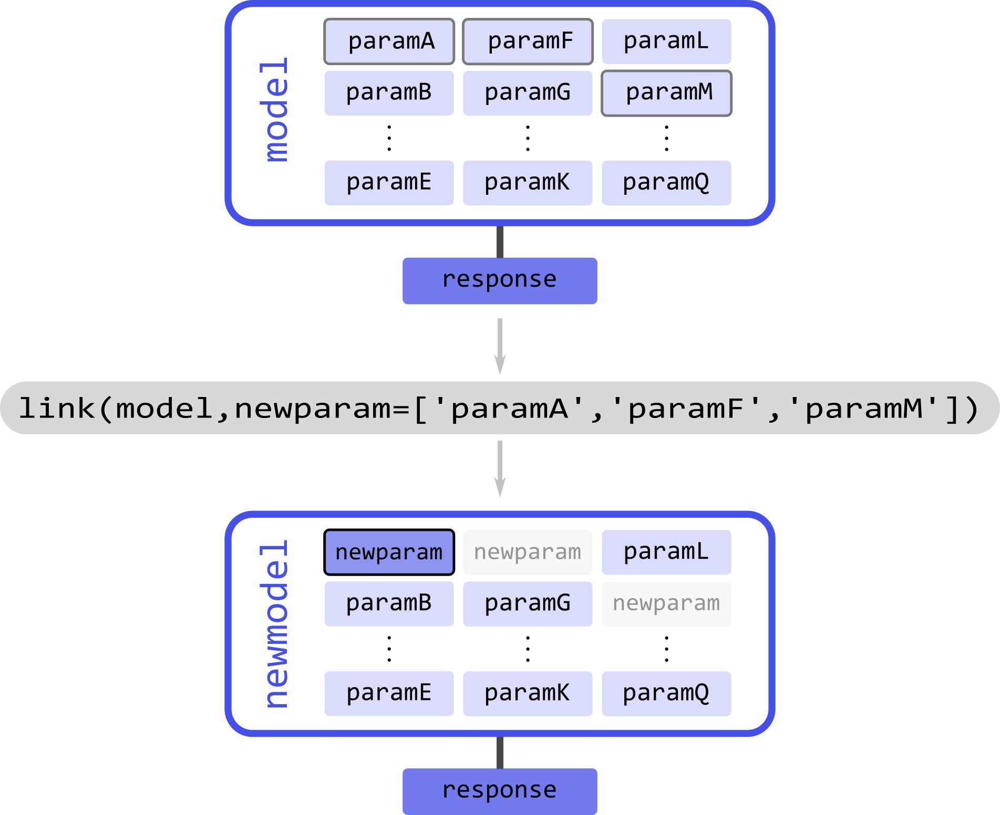
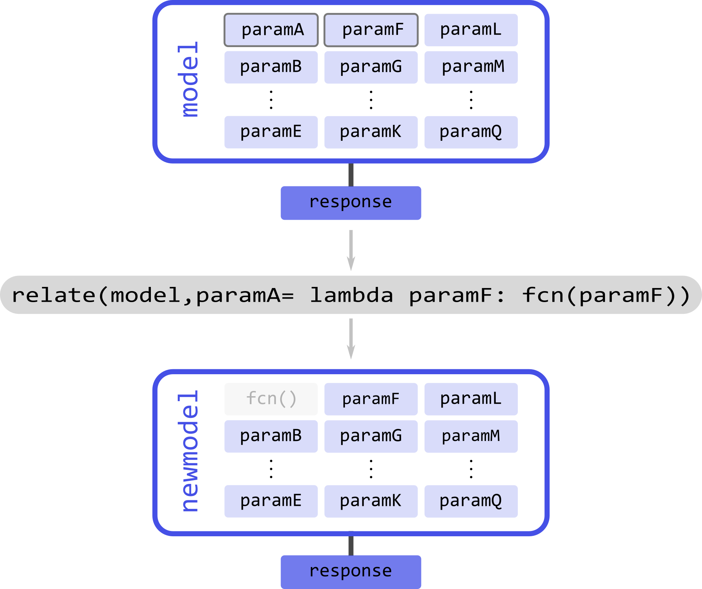

.. _modelling_guide:

Modeling Guide
=========================================

The core functionality of DeerLab focuses on the construction, manipulation, and fitting of models. In this way, the workflow of DeerLab for any application can be structured as follows:

1) Loading of the experimental dataset(s) and pre-processing (if strictly necessary).
2) Modelling of the datasets. 
3) Fitting of the models to the datasets. 

In this guide, we will focus on the second step, i.e., the modeling. We will introduce all model-related concepts.

The ``Model`` object
--------------------

All models in DeerLab pertain to the ``deerlab.model.Model`` class. All functions returning models as their outputs will return such ``Model`` objects. You can check whether a variable is a model by using the ``type()`` function. For example: ::

    >>> type(dl.dd_gauss)
    deerlab.model.Model

Models in DeerLab have two essential components: model parameters and a model function that takes those parameters.

Model Parameters
****************

The model parameters are those quantities that parametrize the model's response and are (usually) the quantity of interest sought to be estimated via DeerLab. DeerLab represents parameters as ``Parameter`` objects which can be accessed using the dot-notation from the model (e.g. ``model.<parameter>``). For example :: 

    >>> type(dl.dd_gauss.mean)
    deerlab.model.Parameter


The ``Parameter`` object
^^^^^^^^^^^^^^^^^^^^^^^^

The ``Parameter`` object contains all the information related to a particular parameter, namely 

Boundaries (``<parameter>.lb`` and ``<parameter>.ub``)
    The upper/lower bounds of the parameter that constrain the parameter values during fitting and optimization. Built-in models models will have pre-defined boundaries, while newly constructed models will have fully unbounded parameters. A parameter is considered unbounded when any of its bounds is set to plus/minus infinity (using the Numpy infinity ``np.inf``). 
    Note that boundaries do not prevent the model from being :ref:`evaluated <modelling_evaluation>` outside the them. 

Start values (``<parameter>.par0``)
    The start values at which the parameters search start during fitting and optimization. Must be initialized within the boundaries. Built-in models will have pre-defined start values, but newly constructed models will not. Start values are required for fitting. If not specified in the model, the start values will be requested when trying to fit the model. 

Linearity (``<parameter>.linear``)
    Whether the parameter is linear (``True``) or non-linear (``False``). In DeerLab, the distinction between linear and non-linear parameters is essential. It allows DeerLab to apply specialized solvers (such as separable non-linear least squares) to find accurate parameter estimates optimally. This attribute is non-editable and is set internally by the model operation functions (see the preceding sections).  

Freezing (``<parameter>.frozen``)
    Whether a parameter is frozen to a specific value. Freezing refers to setting a parameter to a static value and to be omitted during the fitting routines. A parameter can be frozen to a certain value by using the method ``<parameter>.freeze(value)``, and set back by using the ``<parameter>.unfreeze()``. If a parameter is frozen, it will have an additional attribute ``<parameter>.value`` containing the value at which the parameter has been frozen. 
    Note that freezing does not prevent the model to be :ref:`evaluated <modelling_evaluation>` at values different than the one at which a parameter has been frozen.

Documentation (``<parameter>.description`` and ``<parameter>.unit``)
    These attributes serve documentation and information purposes and do not affect neither the evaluation nor fitting of the model. Both can be edited as strings; ``<parameter>.description`` contains a brief description of the parameter and ``<parameter>.unit`` contains the SI units of the parameter if any. For newly constructed models, both attributes are set to ``None`` and need ot be manually filled. 

A summary of the model and all its parameters and related attributes can be quickly accessed by printing the ``Model`` object. For example :: 

    >>>print(dl.dd_gauss)
    Description: Gaussian distribution model
    Signature: (r, mean, std)
    Constants: [r]
    Parameter Table: 
    ====== ======= ======= ======= ======== ======== ====== ==================== 
    Name   Lower   Start   Upper    Type    Frozen   Unit   Description         
    ====== ======= ======= ======= ======== ======== ====== ==================== 
    mean       1     3.5      20   nonlin     No      nm    Mean                
    std     0.05     0.2     2.5   nonlin     No      nm    Standard deviation  
    ====== ======= ======= ======= ======== ======== ====== ====================

.. _modelling_modifying_parameters:

Modifying parameter attributes
^^^^^^^^^^^^^^^^^^^^^^^^^^^^^^

Any editable parameter attribute can be modified by simple assigning the new value to the corresponding attribute. For example: ::

    model = dl.dd_gauss
    # Set a new value for the `mean` parameter upper boundary
    model.mean.ub = 10    
    # Set a start value for the `std` parameter
    model.std.par0 = 10    

The ``set`` method allows the assignment of multiple new attribute values to the same parameter. The attributes are specified as keywords and the values as arguments. For example: ::

    # Set a new boundaries and start value for the `mean` parameters
    model.mean.set(lb=0, ub=10, par0=5, description='Mean value of a Gaussian')


.. _model_function:

Model function 
**************

DeerLab's ``Model`` object implements a concrete yet completely general mathematical structure for the models. The ``Model`` object assumes that the model function is defined in the following form: 

.. math:: y = A(\theta_\mathrm{nonlin})\theta_\mathrm{lin}

where `A(\theta_\mathrm{nonlin})` is a non-linear function which takes the model's non-linear parameters `\theta_\mathrm{nonlin}`, and returns a vector/matrix that is multiplied by the model's linear parameters `\theta_\mathrm{lin}` to generate the model's response `y`. If a model has no linear parameters, DeerLab will assume `\theta_\mathrm{lin}=1`.

Before constructing any ``Model`` object, the underlying model function must be brought to this form to identify the terms listed above. 


.. _modelling_construction:

Model construction 
------------------

In this section, we will look at how to construct custom ``Model`` objects from scratch. DeerLab provides a large selection of pre-defined models and model generators for dipolar EPR spectroscopy-specific applications.

Models without linear parameters 
*********************************

If the model consists of just non-linear parameters and no linear parameters, we first need to define the non-linear function `A(\theta_\mathrm{nonlin})`. The function must take each non-linear parameter as a separate input argument. Then the model constructor ``Model()`` can be called to generate the model from the defined function.   ::

    # Definition of the non-linear function of the model
    def nonlinear_fcn(nonlinparam1,nonlinparam2,*nonlinparamN):
        y = ...
        return y
    # Construction of the model
    mymodel = dl.Model(nonlinear_fcn)

The program will generate and return a ``Model`` instance (here assigned to ``mymodel``). The model will have a non-linear ``Parameter`` object assigned for each argument defined in ``nonlinear_fcn``:: 

    >>> type(mymodel.nonlinparam1)
    deerlab.model.Parameter
    >>> type(mymodel.nonlinparamN)
    deerlab.model.Parameter

Now the model can be called to return the output of ``nonlinear_fcn`` ::

    y = mymodel(nonlinparam1,nonlinparam2,*nonlinparamN)

.. _modelling_example1:

Example: Gaussian model
^^^^^^^^^^^^^^^^^^^^^^^

For example, let's consider a Gaussian function given by: 

.. math:: y(\langle x \rangle,\sigma) = \exp\left(-\frac{(x - \langle x \rangle)^2}{2\sigma^2} \right)

centered about `\langle x \rangle`, and with a width given by `\sigma`. The function has two non-linear parameters (`\langle x \rangle` and `\sigma`), and no linear parameters. Therefore, we could define the following function: ::

    x = np.linspace(0,10,500)
    # Define the non-linear function 
    def gaussian_fcn(center,std):
        y = np.exp(-(x-center)**2/(2*std**2))
        return y 
    # Construct the model
    gauss = dl.Model(gaussian_fcn)

To control that the model has been properly constructed, we can print the model :: 

    >>> print(gauss)
    Description: None
    Signature: (center, std)
    Constants: []
    Parameter Table: 
    ======== ======= ======= ======= ======== ======== ====== ============= 
    Name     Lower   Start   Upper    Type    Frozen   Unit   Description  
    ======== ======= ======= ======= ======== ======== ====== ============= 
    center    -inf     -       inf   nonlin     No     None   None         
    std       -inf     -       inf   nonlin     No     None   None         
    ======== ======= ======= ======= ======== ======== ====== ============= 

We can see that the model has properly introduced the two non-linear parameters ``center`` and ``std``. By default, all new parameters are initialized unbounded (i.e. ``lb=-np.inf`` and  ``ub=+np.inf``). Any attributes can be changed freely after the model has been generated. For example ::

    # Set the boundaries of the model parameters
    gauss.center.set(lb=0, ub=10)
    gauss.std.set(lb=0, ub=0.5)


Models with linear parameters 
******************************
Linear parameters do not take part in the non-linear function of the model and hence must be declared after the non-linear part of the model has been constructed (as described in the previous section). Using the ``addlinear`` method of the ``Model`` class, we can introduce any number of linear parameters to the model. The ``addlinear`` method takes the name of the parameter as its first argument. Other attributes of the linear parameter (such as boundaries) can be specified as additional keyword arguments. 
It is important to note that the order in which the parameters are introduced must match the shape of the matrix returned by ``nonlinear_fcn``.

Additionally, DeerLab introduces another distinction between linear parameters. In addition, linear parameters can be defined in scalar or vector form. 


Adding linear parameters in scalar form
^^^^^^^^^^^^^^^^^^^^^^^^^^^^^^^^^^^^^^^

In this case, the linear parameters are defined by a single value (scalar). To add scalar linear parameters, we can use the function ``addlinear`` as follows:  ::

    # Definition of the non-linear function of the model
    def nonlinear_fcn(nonlinparam1,nonlinparam2,*nonlinparamN):
        y = ...
        return y
    # Construction of the model
    mymodel = dl.Model(nonlinear_fcn)

    # Add linear parameter
    mymodel.addlinear('linparam1')
    # Add linear parameter with boundaries
    mymodel.addlinear('linparam2',lb=0, ub=1)


.. _modelling_example2:

Example: Bimodal Gaussian model
^^^^^^^^^^^^^^^^^^^^^^^^^^^^^^^^

For example, let's consider a bimodal Gaussian function given by: 

.. math:: y = w_1\exp\left(-\frac{(x - \langle x \rangle_1)^2}{2\sigma_1^2} \right) + w_2\exp\left(-\frac{(x - \langle x \rangle_2)^2}{2\sigma_2^2} \right)

where `\langle x \rangle_n` are the centers, `\sigma_n` the width, and `w_n` the amplitudes of the Gaussian components. First, we need to bring this in the form `y = A(\theta_\mathrm{nonlin})\theta_\mathrm{lin}`, we can write the model function above in a linear algebra form 

.. math::

    y = \begin{bmatrix}
            \exp\left(-\frac{(x - \langle x \rangle_1)^2}{2\sigma_1^2} \right) \\
            \exp\left(-\frac{(x - \langle x \rangle_2)^2}{2\sigma_2^2} \right)
        \end{bmatrix}
    \begin{bmatrix} w_1 \\ w_2   \end{bmatrix} 

We can identify that the function has four non-linear parameters (`\langle x \rangle_n` and `\sigma_n` ), and two linear parameters (`w_n` ).

Therefore, we could define the following function: ::

    x = np.linspace(0,10,500)
    # Define the non-linear function 
    def bigaussian_fcn(center1,std1,center2,std2):
        gauss1 = np.exp(-(x-center1)**2/(2*std1**2)) # First Gaussian component
        gauss2 = np.exp(-(x-center2)**2/(2*std2**2)) # Second Gaussian component
        Anonlin = np.vstack([gauss1,gauss2]) # Stack them vertically into a matrix
        return Anonlin
    # Construct the model
    bigauss = dl.Model(bigaussian_fcn)
    # Add linear parameters (with non-negativity constraint)
    bigauss.addlinear('weight1', lb=0)
    bigauss.addlinear('weight2', lb=0)

As before, we can check the state of the model by printing the ``mymodel`` object: ::

    >>> print(bigauss)
    Description: None
    Signature: (center1, std1, center2, std2, weight1, weight2)
    Constants: []
    Parameter Table: 
    ========= ======= ======= ======= ======== ======== ====== ============= 
    Name      Lower   Start   Upper    Type    Frozen   Unit   Description  
    ========= ======= ======= ======= ======== ======== ====== ============= 
    center1    -inf     -       inf   nonlin     No     None   None         
    std1       -inf     -       inf   nonlin     No     None   None         
    center2    -inf     -       inf   nonlin     No     None   None         
    std2       -inf     -       inf   nonlin     No     None   None         
    weight1       0     -       inf   linear     No     None   None         
    weight2       0     -       inf   linear     No     None   None         
    ========= ======= ======= ======= ======== ======== ====== =============  

We can see that the model has been correctly built, with four non-linear parameters (``center1``, ``center2``, ``std1``, and ``std2``) 
and with two linear parameters (``weight1`` and ``weight2``), as indicated by the ``Type`` column. We can check whether a parameter is linear or non-linear by accessing its ``linear`` attribute, e.g.  :: 

    >>> bigauss.center1.linear
    False
    >>> bigauss.weight1.linear
    True

Adding linear parameters in vector form
^^^^^^^^^^^^^^^^^^^^^^^^^^^^^^^^^^^^^^^

In some cases (for example, in semi-parametric modeling), a vector of values might describe a linear parameter more appropriately than a single value. In DeerLab, we can add a linear parameter as a vector with `N`-elements to a model using the ``addlinear`` method with the ``vec=N`` keyword argument.  ::

    # Definition of the non-linear function of the model
    def nonlinear_fcn(nonlinparam1,nonlinparam2,*nonlinparamN):
        y = ...
        return y
    # Construction of the model
    mymodel = dl.Model(nonlinear_fcn)

    # Add vector-form linear parameter (vector with N-elements)
    mymodel.addlinear('linparam1', vec=N)

The new parameter ``linparam1`` will now refer to the whole `N`-element vector of values. 

.. _modelling_example3:

Example: Gaussian convolution of a non-parametric distribution
^^^^^^^^^^^^^^^^^^^^^^^^^^^^^^^^^^^^^^^^^^^^^^^^^^^^^^^^^^^^^^^

For example, let us construct a model describing the Gaussian convolution of a non-parametric distribution, which we can write as: 

.. math::

        y(x,\sigma) = \int dz \exp\left(-\frac{(x-z)^2}{2\sigma^2} \right) P(z) = \int dz K(x,z) P(z)

where `K(x,z,\sigma)` is the Gaussian kernel, and `P(z)` is the non-parametric distribution. Such an integral equation can be quickly be brought into matrix form 

.. math::

        \mathbf{y} = \mathbf{K}(\sigma) \mathbf{P}

where we recognize `\mathbf{K}(\sigma)` as the non-linear term, depending on a single non-linear parameter (`\sigma`) and a linear parameter vector `\mathbf{P}`.

The model can be constructed as follows: ::

    x = np.linspace(0,10,300)
    z = np.linspace(0,10,200)
    # Define the non-linear function 
    def gausskernel_fcn(sigma):
        gausskernel = np.zeros((len(x),len(z)))
        for n, z_ in enumerate(z):
            gausskernel[:,n] = np.exp(-(x-z_)**2/(2*sigma**2))   
        return gausskernel
    # Construct the model
    gaussconv = dl.Model(gausskernel_fcn)

    # Add vector-form linear parameter (with non-negativity constraint)
    gaussconv.addlinear('dist', vec=len(z), lb=0)

By printing the model, we can check that the model has only two parameters: ::

    >>> print(gaussconv)
    Description: None
    Signature: (sigma, dist)
    Constants: []
    Parameter Table: 
    ======= ======= ======= ======= ======== ======== ====== ============= 
    Name    Lower   Start   Upper    Type    Frozen   Unit   Description  
    ======= ======= ======= ======= ======== ======== ====== ============= 
    sigma    -inf     -       inf   nonlin     No     None   None         
    dist        0     -       inf   linear     No     None   None         
    ======= ======= ======= ======= ======== ======== ====== =============  


Imposing normalization on the linear parameters
^^^^^^^^^^^^^^^^^^^^^^^^^^^^^^^^^^^^^^^^^^^^^^^^

Sometimes, the linear parameters represent quantities that have certain normalization constraints. For example, a linear parameter representing a probability density function would require its trapezoidal integration to equal one. Such normalization criteria can be specified via the ``normalization`` optional argument of the ``addlinear`` method.   ::

    # Definition of the non-linear function of the model
    def nonlinear_fcn(nonlinparam1,nonlinparam2,*nonlinparamN):
        y = ...
        return y
    # Construction of the model
    mymodel = dl.Model(nonlinear_fcn)

    # Add vector-form linear parameter (vector with N-elements) with a normalization condition
    mymodel.addlinear('linparam1', vec=N, normalization= lambda linparam1: fcn(linparam1))

Specifying normalization criteria does not affect the model evaluation or fitting. However, when the model is fitted and the fitted parameters are reported, the program will report the normalized value of ``linparam1`` as well as an additional value ``linparam1_scale`` which reports the normalization factor/scale of the linear parameter. 

.. _modelling_constants:

Models with constants 
*********************

Thus far, we have seen how to construct models that depend solely on model parameters. In some cases, however, we might want to have other variables (usually known) that are part of the definition of the model but do not need to be considered parameters. DeerLab refers to those as "constants", as they will remain unchanged during the fitting/optimization processes. 

Constants can be defined in the non-linear function along with the other non-linear parameters. Constants need to be additionally specified   
during the model construction using the ``constants`` keyword argument :: 

    # Definition of the non-linear function of the model with constants
    def nonlinear_fcn(nlpar1,const1,nlpar2,const2):
        y = ...
        return y
    # Construction of the model
    mymodel = dl.Model(nonlinear_fcn,constants=['const1','const2'])

Constants have no associated ``Parameter`` objects in the resulting model. In the example above, ``mymodel`` would have two parameters ``nlpar1`` and ``nlpar2``, while ``const1`` and ``const2`` would be internally defined as constants.    

Example: Gaussian model with a variable axis
^^^^^^^^^^^^^^^^^^^^^^^^^^^^^^^^^^^^^^^^^^^^^^

For example, let's model a Gaussian function defined on an arbitrary axis: 

.. math:: y(x,\langle x \rangle,\sigma) = \exp\left(-\frac{(x - \langle x \rangle)^2}{2\sigma^2} \right)

centered about `\langle x \rangle`, with a width given by `\sigma`. The function has two non-linear parameters (`\langle x \rangle` and `\sigma`), and no linear parameters. The axis `x` should be modifiable but not a parameter. Therefore, we could define the following function with the axis set as a constant: ::

    # Define the non-linear function 
    def gaussian_fcn(x,center,std):
        y = np.exp(-(x-center)**2/(2*std**2))
        return y 
    # Construct the model
    xgauss = dl.Model(gaussian_fcn, constants='x')

Let us print the model to examine the resulting model: ::

    >>>print(xgauss)
    Description: None
    Signature: (x, center, std)
    Constants: [x]
    Parameter Table: 
    ======== ======= ======= ======= ======== ======== ====== ============= 
    Name     Lower   Start   Upper    Type    Frozen   Unit   Description  
    ======== ======= ======= ======= ======== ======== ====== ============= 
    center    -inf     -       inf   nonlin     No     None   None         
    std       -inf     -       inf   nonlin     No     None   None         
    ======== ======= ======= ======= ======== ======== ====== ============= 

We can see that the model has only the two non-linear parameters as expected, and under ``Constants`` we can see that ``x`` has been adequately defined. From the ``Signature`` we can also check that the ``x`` constant can be passed to evaluate the model. 


.. _modelling_evaluation: 

Model evaluation
-----------------

All ``Model`` objects can be called as normal functions by specifying the parameters and constants required by the model. These can be specified as positional and/or keyword arguments. If unsure of the model's parameter names or their order, the easiest way to get all the information required to call a model is to print the model object. For example ::

    >>>print(xgauss)
    Description: None
    Signature: (x, center, std)
    Constants: [x]
    Parameter Table: 
    ======== ======= ======= ======= ======== ======== ====== ============= 
    Name     Lower   Start   Upper    Type    Frozen   Unit   Description  
    ======== ======= ======= ======= ======== ======== ====== ============= 
    center    -inf     -       inf   nonlin     No     None   None         
    std       -inf     -       inf   nonlin     No     None   None         
    ======== ======= ======= ======= ======== ======== ====== ============= 

In the model printout, under ``Signature`` the exact signature of the model is given. The order and names of the arguments are as shown there.


Calling with keyword arguments
******************************

Keyword arguments provide a simple way of specifying model arguments without needing to know about their definition order. By using keyword-argument pairs, we can specify all model arguments in any order. In the example above,: ::

    # Define model parameters and constants
    axis = np.linspace(0,10,200)
    mycenter = 5 
    mystd = 0.3
    # Evaluate using keyword arguments
    y = model(x=axis, std=mystd, center=mycenter)


Calling with positional arguments
*********************************

Positional arguments do not require knowledge of the parameters'/constants' names but of the order, they are defined.
In the example above, we would need to first pass ``x``, ``center`` and ``std`` in that exact order :: 

    # Define model parameters and constants
    axis = np.linspace(0,10,200)
    mycenter = 5 
    mystd = 0.3
    # Evaluate using positional arguments
    y = xgauss(axis,mycenter,mystd)

Calling with mixed arguments
****************************

A mixture of positional and keyword arguments can be used to specify the model arguments. As required in Python, the positional arguments must be specified first (in the correct order), followed by the keyword arguments (in any order). In the example above: ::

    # Define model parameters and constants
    axis = np.linspace(0,10,200)
    mycenter = 5 
    mystd = 0.3
    # Evaluate using mixed arguments
    y = xgauss(axis,std=mystd,center=mycenter)


Model operations
----------------

Up until now, we have seen how to construct and evaluate user-defined models. The following sections will focus on a collection of operations to construct/design complex models out of simpler ones. 

.. _modelling_merging:

Merging
******* 

In DeerLab, we refer to a merge of models to combine a series of models and their outputs. A model merge takes several models and returns a single model, whose output consists of a list of all the outputs of the original models. With these operations, we can construct a single model that describes multiple datasets locally or globally. Merging models is an essential step towards constructing models for multi-dataset fitting. 




For example, take three models, ``model1``, ``model3``, and ``model3`` (illustrated above), to be merged. Each model has a series of parameters ``param(#)`` and a corresponding response/output ``responseN``. To merge the models and their responses, we must call the ``merge`` function and pass all models to be merged. The function will return the new merged model :: 

    newmodel = dl.merge(model1, model2, model3)

Upon merging to any input model not possessing linear parameters, a single ``scale`` linear parameter will be added to it to ensure that the mathematical model structure of the output model holds. 

As the names of the parameters of all the input models are inherited, to avoid duplicate parameter names, a numeric suffix ``_N``` will always be added to all parameter names (``N`` indicating the index of the model it originated from). Thus, suffix ``_1`` for all parameters from the first model passed on to ``merge``, ``_2`` for all parameters from the second model passed on to ``merge``, and so on (see the illustration above).  


If the new model ``newmodel`` is called with the appropriate parameters, it will return a list of responses instead of a single one. The list will contain the responses of the original models used in the merging in the same order as the model was specified. ::

    responses_list = newmodel(*parameters) # Get all responses as a list
    response1, response2, response3 = newmodel(*parameters) # Get the individual responses

Models that are products of a merge will later require multiple datasets to be fitted (one dataset per model merged). See later for details.

Example: Merging two Gaussian models 
^^^^^^^^^^^^^^^^^^^^^^^^^^^^^^^^^^^^

Let us take a straightforward example, where we merge two Gaussian models, taking the ``gauss`` model defined in :ref:`a previous example <modelling_example1>` ::

    # Merge two Gaussian models
    mergegauss = dl.merge(gauss,gauss) 

As always, we can check the results of the operation by printing the model for a summary: :: 

    >>>print(mergemodel)
    Description: None
    Signature: (center_1, width_1, center_2, width_2, scale_1, scale_2)
    Constants: []
    Parameter Table: 
    ========== ======= ======= ======= ======== ======== ====== ================ 
    Name       Lower   Start   Upper    Type    Frozen   Unit   Description     
    ========== ======= ======= ======= ======== ======== ====== ================ 
    center_1    -inf     -       inf   nonlin     No     None   None            
    std_1       -inf     -       inf   nonlin     No     None   None            
    center_2    -inf     -       inf   nonlin     No     None   None            
    std_2       -inf     -       inf   nonlin     No     None   None            
    scale_1        0       1     inf   linear     No     None   Scaling factor  
    scale_2        0       1     inf   linear     No     None   Scaling factor  
    ========== ======= ======= ======= ======== ======== ====== ================ 


We can see that the merge has been successful. The model now takes the parameters of both ``gauss`` models, and their names have been adapted with the respective suffixes as described above. Now we can call the ``mergemodel`` to get both Gaussians responses, both centered equally, but the second being twice as broad as the first one: ::

    # Evaluate the model to get both Gaussians 
    gaussian1, gaussian2 = mergemodel(center_1=4, width_1=0.3, scale_1=1,
                                      center_2=4, width_1=0.6, scale_2=1) 

We can double-check that the responses are correct by comparing the ``gaussian1`` and ``gaussian2`` to the responses of the original ``gauss`` model evaluated with the parameter subsets and seeing that they are equal. 

Linear combinations
*******************

The :ref:`mathematical structure <model_function>` of the plain models does not allow the definition of model function consisting of sums of terms. DeerLab provides the function ``lincombine`` to generate models, whose output/response is a linear combination of the outputs of the input models.  

.. image:: ./images/modelling_guide_lincombine.png
   :width: 40%
   :align: center

For example, take three models, ``model1``, ``model3``, and ``model3`` (illustrated above), to be linearly combined. Each model has a series of parameters ``param(#)`` and a corresponding response/output ``responseN``. To merge the models and their responses, we must call the ``lincombine`` function and pass all models to be linearly combined. The function will return the new linearly combined model :: 

    newmodel = dl.lincombine(model1, model2, model3)

Upon merging to any input model not possessing linear parameters, a single ``scale`` linear parameter will be added to it to ensure that the mathematical model structure of the output model holds. 
As in the ``merge`` function, since the names of the parameters of all the input models are inherited, to avoid duplicate parameter names, a numeric suffix ``_N``` will always be added to all parameter names (``N`` indicating the index of the model it originated from). Thus, suffix ``_1`` for all parameters from the first model passed on to ``lincombine``, ``_2`` for all parameters from the second model passed on to ``lincombine``, and so on (see the illustration above).  


If the new model ``newmodel`` is called with the appropriate parameters, it will return a new response, which will be the sum of responses of all the original models ::

    newresponse = newmodel(*parameters) 
    # newresponse = response1 + response1 + response3

The relative weighting of the responses is (typically) controlled by the linear parameters of the individual linearly combined models. However, it might be necessary to introduce non-linear weighting parameters for the linear combination in certain situations. 



The function ``lincombine`` allows adding non-linear weighting parameters via the ``addweights`` keyword. Enabling this will result in the new linearly combined model ``newmodel`` to be returned with three additional non-linear parameters ``weight_N`` for each combined model and its response.

If the new model ``newmodel`` is called with the appropriate parameters, it will now return a new response, which will be the weighted sum of responses of all the original models ::

    newresponse = newmodel(*parameters) 
    # newresponse = weight1*response1 + weight2*response1 + weight3*response3

Example: Bimodal Gaussian as a linear combination
^^^^^^^^^^^^^^^^^^^^^^^^^^^^^^^^^^^^^^^^^^^^^^^^^

In this example, let us construct the model of a bimodal Gaussian from the linear combination of two unimodal Gaussian ``gauss`` models defined in :ref:`another example <modelling_example1>` ::  

    # Linear combination of two Gaussians
    bigauss = dl.lincombine(gauss, gauss)

As always, we can check the results of the operation by printing the model for a summary: :: 

    >>>print(bigauss)
    Description: None
    Signature: (center_1, width_1, center_2, width_2, scale_1, scale_2)
    Constants: []
    Parameter Table: 
    ========== ======= ======= ======= ======== ======== ====== ================ 
    Name       Lower   Start   Upper    Type    Frozen   Unit   Description     
    ========== ======= ======= ======= ======== ======== ====== ================ 
    center_1    -inf     -       inf   nonlin     No     None   None            
    std_1       -inf     -       inf   nonlin     No     None   None            
    center_2    -inf     -       inf   nonlin     No     None   None            
    std_2       -inf     -       inf   nonlin     No     None   None            
    scale_1        0       1     inf   linear     No     None   Scaling factor  
    scale_2        0       1     inf   linear     No     None   Scaling factor  
    ========== ======= ======= ======= ======== ======== ====== ================ 

We can see that the merge has been successful. The model now takes the parameters of both ``gauss`` models, and their names have been adapted with the respective suffixes described above—the newly introduced linear parameters ``scale_1`` and ``scale_2`` work as linear combination weights. 


Now we can evaluate the bimodal Gauss model by calling ``bigauss``, for instance in a case where the second Gaussian is weighted doubly in the linear combination with respect to the first one :: 

    # Evaluate linearly combined bimodal Gaussian 
    bigaussian = mergemodel(center_1=4, width_1=0.3, scale_1=1,
                            center_2=4, width_1=0.6, scale_2=2) 


Example: Weighted linear combination of two non-parametric distributions
^^^^^^^^^^^^^^^^^^^^^^^^^^^^^^^^^^^^^^^^^^^^^^^^^^^^^^^^^^^^^^^^^^^^^^^^

In this example, we will construct a model describing a linear combination of two non-parametric distributions. For the sake of simplicity, we will use the Gaussian-convoluted non-parametric distribution ``gaussconv`` model defined in :ref:`a previous example <modelling_example3>`. Now, we do not want the weighting of the linear combination to arise from the linear parameters. For that purpose, we must use the ``addweights`` keyword argument when doing the linear combination :: 

    # Linearly combine both models with non-linear weighting parameters
    combmodel = dl.lincombine(gaussconv, gaussconv, addweights=True)

and we can check the resulting model ::

    >>>print(combmodel)
    Description: None
    Signature: (sigma_1, weight_1, sigma_2, weight_2, dist_1, dist_2)
    Constants: []
    Parameter Table: 
    ========== ======= ======= ======= ======== ======== ====== ================== 
    Name       Lower   Start   Upper    Type    Frozen   Unit   Description       
    ========== ======= ======= ======= ======== ======== ====== ================== 
    sigma_1     -inf     -       inf   nonlin     No     None   None              
    weight_1       0       1     inf   nonlin     No     None   Weighting factor  
    sigma_2     -inf     -       inf   nonlin     No     None   None              
    weight_2       0       1     inf   nonlin     No     None   Weighting factor  
    scale_1        0       1     inf   linear     No     None   Scaling factor    
    scale_2        0       1     inf   linear     No     None   Scaling factor    
    ========== ======= ======= ======= ======== ======== ====== ================== 


The linearly combined model has been successfully constructed, and the non-linear weighting parameters ``weight_1`` and ``weight_2`` have also been included in the model as requested. 

Linking
*******

Parameter linking refers to the introduction of equality constraints between two or more parameters within a model. Parameter linking reduces the number of parameters and is crucial for the global analysis of multi-dataset models. DeerLab provides the function ``link`` for the introduction of such constraints between parameters in a model. 



Take the example illustrated above with a ``model`` model and a series of parameters ``param(#)``. Assume that we know that ``paramA``, ``paramF``, and ``paramM`` are equal, and we want to link them. The linking operation will create a new model, where all of the linked parameters have been removed and substituted by a new parameter representing all of the linked parameters. The response of the new model will remain unchanged with respect to the original one. Now, the ``link`` function employs the following syntax: first, it takes the model where the linking operation is to take place; second, it takes keyword-argument pairs where the arguments are lists of the parameter names to be linked together, and the keyword represents the new name to assign to the new linked parameter ::

    # Link three model parameters
    newmodel = dl.link(model, newparam=['paramA','paramF','paramM'])

The output model ``newmodel`` will have a new parameter ``newparam`` instead of the ``paramA``, ``paramF``, ``paramM`` parameters. With ``link``, several linking operations can be performed by specifying multiple keyword-argument pairs ::

    # Perform three linking operation on the model
    newmodel = dl.link(model, newparam1=paramlist1, newparam2=paramlist2, newparam3=paramlist3)

Example: Two Gaussians of equal width 
^^^^^^^^^^^^^^^^^^^^^^^^^^^^^^^^^^^^^

s
To enforce equality of widths for the two Gaussians in the ``bigauss`` model, we must link the ``std1`` and ``std2`` parameters together. Since there will only be one width parameter in the linked model, we will assign the link to a new ``std`` parameter :: 

    # Link the width parameters 
    bigauss_linked = dl.link(bigauss, std=['std1','std2'])

and check the model by printing it :: 

    >>>print(bigauss_linked)
    Description: None
    Signature: (center1, std, center2, weight1, weight2)
    Constants: []
    Parameter Table: 
    ========= ======= ======= ======= ======== ======== ====== ============= 
    Name      Lower   Start   Upper    Type    Frozen   Unit   Description  
    ========= ======= ======= ======= ======== ======== ====== ============= 
    center1    -inf     -       inf   nonlin     No     None   None         
    std        -inf     -       inf   nonlin     No     None   None         
    center2    -inf     -       inf   nonlin     No     None   None         
    weight1       0     -       inf   linear     No     None   None         
    weight2       0     -       inf   linear     No     None   None         
    ========= ======= ======= ======= ======== ======== ====== ============= 


The model now has the new ``std`` parameter instead of the ``std1`` and ``std2`` parameters. The linkage can be checked by comparing the two models ::

    # Evaluate the original model
    response_unlinked = bigauss(center1=5, std1=0.3, amplitude1=1,
                                center2=3, std2=0.3, amplitude1=2)
    # Evaluate the linked model
    response_linked = bigauss(center1=5, amplitude1=1, std=0.3
                              center2=3, amplitude1=2)


Relating
********

Similar to linking but more generally is the related operation. DeerLab refers to relating to the introduction of any functional relationship between two or more parameters. Using the ``relate`` function, DeerLab can introduce such relationships. 




Take the example illustrated above with a ``model`` model and a series of parameters ``param(#)``. Assume that we know that ``paramA`` depends on the ``paramF`` parameter. The relating operation will create a new model, where ``paramA`` has been removed and its value is given by some function of the value ``paramF`` parameter. The response of the new model will remain unchanged with respect to the original one. 


The ``relate`` function employs the following syntax: first, it takes the model where the operation takes place; second, it takes keyword-argument pairs. The keyword denotes the parameter which is to be deleted and substituted by the function. The argument must be a callable function (e.g., a ``lambda`` function), whose arguments must be valid parameter names, and which returns the value to be set for the assigned parameter :: 

    # Relate paramA to paramF 
    newmodel = dl.relate(model, paramA = lambda paramF: fcn(paramF))

The output model ``newmodel`` will have a parameter less for relate operation performed. Several functional relationships can be defined by specifying multiple keyword-argument pairs ::

    # Define three functional relationships in the model
    newmodel = dl.relate(model, paramA = lambda paramF: fcn1(paramF),
                                paramB = lambda paramA: fcn2(paramA),
                                paramG = lambda paramQ: fcn3(paramQ))
                    

The function will internally determine the best order in which to perform these operations. However, it cannot handle circular functional relationships. 

Example: Two Gaussians of related width
^^^^^^^^^^^^^^^^^^^^^^^^^^^^^^^^^^^^^^^

For this example, we will model a bimodal Gaussian function where one of the Gaussian components has twice the width of the other one. We will use the ``bigauss`` from :ref:`a previous example <modelling_example2>` as the basis model.  

To enforce the functional relationship between the widths of the two Gaussians in the ``bigauss`` model, we must relate the ``std1`` parameter to the ``std2`` parameter, such that the former's value is twice the latter's value  ::  

    # Relate the width parameters 
    bigauss_related = dl.relate(bigauss, std1 = lambda std2: 2*std2)

and check the model by printing it :: 

    >>>print(bigauss_related)
    Description: None
    Signature: (center1, std1, center2, weight1, weight2)
    Constants: []
    Parameter Table: 
    ========= ======= ======= ======= ======== ======== ====== ============= 
    Name      Lower   Start   Upper    Type    Frozen   Unit   Description  
    ========= ======= ======= ======= ======== ======== ====== ============= 
    center1    -inf     -       inf   nonlin     No     None   None         
    center2    -inf     -       inf   nonlin     No     None   None         
    std2       -inf     -       inf   nonlin     No     None   None         
    weight1       0     -       inf   linear     No     None   None         
    weight2       0     -       inf   linear     No     None   None         
    ========= ======= ======= ======= ======== ======== ====== ============= 

The ``std1`` parameter has been removed from the parameter list as it is now given twice the value of ``std2``.

Adding isolated non-linear parameters
^^^^^^^^^^^^^^^^^^^^^^^^^^^^^^^^^^^^^

DeerLab provides the model method ``addnonlinear`` to add non-linear parameters to the model. These parameters will be isolated because they will not a priori affect the model function in any way. However, this functionality is helpful to introduce new parameters that functionalize any of the original parameter models. 

If two model parameters ``paramA`` and ``paramB`` can be defined as different functions of one (undefined) parameter ``paramext`` we can combine the ``addnonlinear`` and ``relate`` functions to implement this ::

    # Add a new non-linear parameter to the model 
    model.addnonlinear('paramext')
    newmodel = dl.relate(model,paramA = lambda paramext: fcn1(paramext),
                               paramB = lambda paramext: fcn2(paramext))

and the resulting model ``newmodel`` will now depend functionally on the ``paramext`` parameter instead of the ``paramA`` and ``paramB`` parameters.  

Example: Two Gaussians with functionalized amplitudes
^^^^^^^^^^^^^^^^^^^^^^^^^^^^^^^^^^^^^^^^^^^^^^^^^^^^^

For this example, we will model a bimodal Gaussian function where the amplitudes of the two Gaussian components can be modeled via some function. We will use the ``bigauss`` from :ref:`a previous example <modelling_example2>` as the basis model. 

Let us assume that the amplitudes `a_1` and `a_2` of the two Gaussians can be modeled as follows: 

.. math:: a_1 = k(1-k) 

.. math:: a_2 = 1 - a_1 

where `k` is some constant that parametrizes the amplitudes. We can now implement the functionalization of ``amplitude1`` and ``amplitude2``. Since the constant `k` is not part of the model, we need to add the non-linear parameter using the ``addnonlinear`` method, and then define the functional relationships via the ``relate`` function :: 

    # Add the constant that parametrizes the amplitudes (defined in range 0-1) 
    bigauss.addnonlinear('k', lb=0, ub=1)
    # Define the functional relationships
    bigauss_related = dl.relate(bigauss, amplitude1 = lambda k: k*(1-k),
                                         amplitude2 = lambda amplitude1: 1-amplitude1)

Even though we have added a new parameter, ``k`` to the model, we have removed both the ``amplitude1`` and ``amplitude2``, effectively reducing the number of parameters in the model. 

Copying 
******* 

Copying models is important when performing several model manipulations to avoid overwriting or modifying other models by accident. It is important to note that just assigning a model to another variable does not copy the model but passes the reference of the object ::

    modelA.description = 'Original'
    modelB = modelA # Assignment does not generate a copy 
    modelB.description = 'Copy' # Will also modify modelA

    >>>print(modelA.description, modelB.description)
    'Copy', 'Copy'

To fully copy a ``Model`` object it is recommended to use the ``deepcopy`` function from the ``copy`` module :: 

    from copy import deepcopy
    modelA.description = 'Original'
    modelB = deepcopy(modelA) # deepcopy the model to a new variable 
    modelB.description = 'Copy' # Will not modify modelA

    >>>print(modelA.description, modelB.description)
    'Original', 'Copy'


