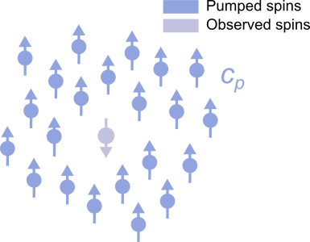

.. highlight:: python
.. _bg_hom3d:

***********************
:mod:`bg_hom3d`
***********************

.. autofunction:: deerlab.bg_models.bg_hom3d

Model
=========================================

This model describes the inter-molecular interaction of one observer spin with a 3D homogenous distribution of pump-spins of concentration `c_p`

The expression for this model is

.. math::
   B(t) = \mathrm{exp}\left(-\frac{8\pi^2}{9\sqrt{3}}\lambda c_p D |t|\right)`

where `c_p` is the pumped-spin concentration (entered in spins/m\ :sup:`3` into this expression) and D is the dipolar constant

.. math::
   D = \frac{\mu_0}{4\pi}\frac{(g_\mathrm{e}\mu_\mathrm{B})^2}{\hbar}

============= ============= ========= ============= ============= =============================================
 Variable       Symbol        Default   Lower bound   Upper bound      Description
============= ============= ========= ============= ============= =============================================
``param(1)``   :math:`c_p`      50          0.01          5000          Pumped spin concentration (μM)
============= ============= ========= ============= ============= =============================================
