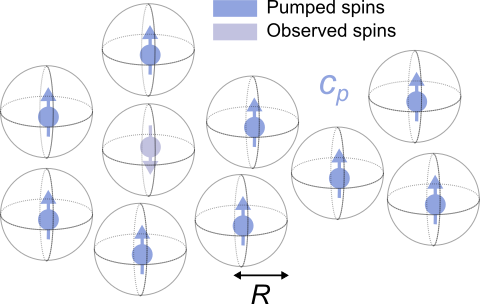

.. highlight:: matlab
.. _bg_hom3dex:

***********************
:mod:`bg_hom3dex`
***********************

Background due to a homogeneous spin distribution in 3D, with excluded volume

-----------------------------

Syntax
=========================================

.. code-block:: matlab

        info = bg_hom3dex()
        P = bg_hom3dex(t,param)
        P = bg_hom3dex(t,param,lambda)

Inputs
    *   ``t`` -- Time axis (N-array)
    *   ``param`` -- Model parameters
    *   ``lambda`` -- Modulation amplitude (between 0 and 1)

Outputs
    *   ``B`` -- Model background (N-array)
    *   ``info`` -- Model information (struct)

-----------------------------

Model
=========================================

This implements a hard-shell excluded-volume model, with pumped spin concentration ``c`` (first parameter, in μM) and distance of closest approach ``R`` (second parameter, in nm).

The expression for this model is

.. math::
   B(t) = \mathrm{exp}\left(-\frac{8\pi^2}{9\sqrt{3}}\alpha(R) \lambda c D |t|\right)`

where :math:`c` is the spin concentration (entered in spins/m\ :sup:`3` into this expression) and :math:`D` is the dipolar constant

.. math::
   D = \frac{\mu_0}{4\pi}\frac{(g_\mathrm{e}\mu_\mathrm{B})^2}{\hbar}

The function :math:`\alpha(R)` of the exclusion distance :math:`R` captures the excluded-volume effect. It is a smooth function, but doesn't have an analytical representation. For details, see `Kattnig et al, J.Phys.Chem.B 2013, 117, 16542 <https://pubs.acs.org/doi/abs/10.1021/jp408338q>`_.

============= =================== ========= ============= ============= ================================================
 Variable      Symbol              Default   Lower bound   Upper bound      Description
============= =================== ========= ============= ============= ================================================
``param(1)``    :math:`c`              50         0.01          1000          spin concentration (μM)
``param(2)``    :math:`R`              1          0.1            20           exclusion distance (nm)
============= =================== ========= ============= ============= ================================================

-----------------------------

Description
=========================================

.. code-block:: matlab

        info = bg_hom3dex()

Returns an ``info`` structure containing the specifics of the model:

* ``info.model`` -- Full name of the parametric model.
* ``info.nparam`` -- Total number of adjustable parameters.
* ``info.parameters`` -- Structure array with information on individual parameters.

-----------------------------

.. code-block:: matlab

    B = bg_hom3dex(t,param)

Computes the background model ``B`` from the axis ``t`` according to the parameters array ``param`` for a modulation amplitude ``lambda=1``. The required parameters can also be found in the ``info`` structure.

-----------------------------

.. code-block:: matlab

    B = bg_hom3dex(t,param,lambda)

Computes the background model ``B`` for a given modulation amplitude ``lambda`` (between 0 and 1).
