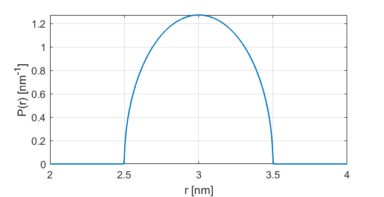

.. highlight:: matlab
.. _dd_circle:

***********************
:mod:`dd_circle`
***********************

Semi-circle distribution

-----------------------------

Syntax
=========================================

.. code-block:: matlab

        info = dd_circle()
        P = dd_circle(r,param)

Parameters
    *   ``r`` - Distance axis (N-array)
    *   ``param`` - Model parameters
Returns
    *   ``P`` - Distance distribution (N-array)
    *   ``info`` - Model information (struct)

-----------------------------

Model
=========================================

This provides a `semi-circle distribution <https://en.wikipedia.org/wiki/Wigner_semicircle_distribution>`_, defined by  :math:`P(r) = 2\pi\sqrt{(r-r_0)^2/R^2+1}` for :math:`r_0-R\le r\le r_0+R` and zero otherwise.

============== ======================== ========= ============= ============= ========================
 Variable       Symbol                    Default   Lower bound   Upper bound      Description
============== ======================== ========= ============= ============= ========================
``param(1)``   :math:`r_0`                 3.0       0.1              20          center
``param(2)``   :math:`R`                   0.5       0.1               5          radius
============== ======================== ========= ============= ============= ========================

Example using default parameters:

-----------------------------

Description
=========================================

.. code-block:: matlab

        info = dd_circle()

Returns an ``info`` structure containing the specifics of the model:

* ``info.model`` -  Full name of the parametric model.
* ``info.nparam`` -  Total number of adjustable parameters.
* ``info.parameters`` - Structure array with information on individual parameters.

-----------------------------

.. code-block:: matlab

    P = dd_circle(r,[3 0.5]])

Computes the distance distribution model ``P`` from the axis ``r`` according to the parameters array ``param``. The required parameters can also be found in the ``info`` structure.

