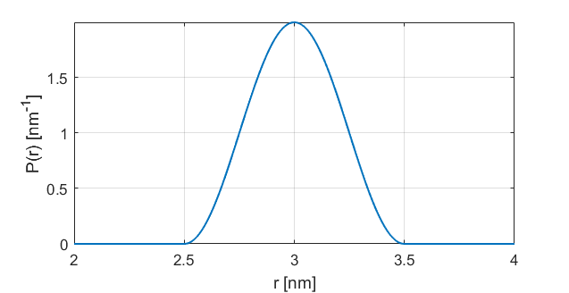

.. highlight:: python
.. _dd_cos:

***********************
:mod:`dd_cos`
***********************

.. autofunction:: deerlab.dd_models.dd_cos

Model
=========================================

This provides a `raised-cosine distribution <https://en.wikipedia.org/wiki/Raised_cosine_distribution>`_, defined by 
:math:`P(r) = \frac{1}{2w}\cos\left(\frac{r-r_0}{w}\pi\right)` for :math:`r_0-w \le r \le r_0+w`, and zero otherwise.

============== ================= ============= ============= ============= =================================
 Variable         Symbol          Start Value   Lower bound   Upper bound      Description
============== ================= ============= ============= ============= =================================
``param[0]``   :math:`r_0`            3.0          0.1              20          center, in nm
``param[1]``   :math:`w`              0.5          0.1               5          fwhm, in nm
============== ================= ============= ============= ============= =================================

Example using the start values:

