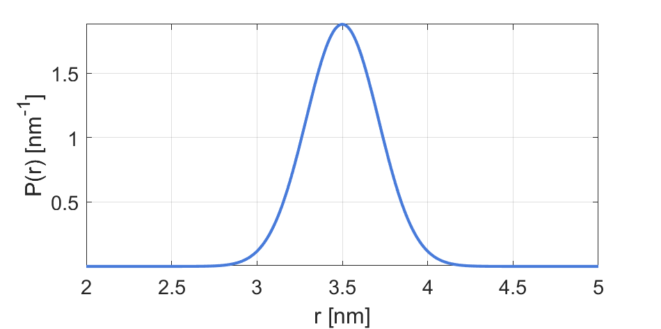

.. highlight:: matlab
.. _dd_onegauss:

***********************
:mod:`dd_onegauss`
***********************

Gaussian distribution

-----------------------------

Syntax
=========================================

.. code-block:: matlab

        info = dd_onegauss()
        P = dd_onegauss(r,param)

Parameters
    *   ``r`` - Distance axis (N-array)
    *   ``param`` - Model parameters
Returns
    *   ``P`` - Distance distribution (N-array)
    *   ``info`` - Model information (struct)

-----------------------------

Model
=========================================

:math:`P(r) = \sqrt{\frac{2}{\pi}}\frac{1}{\sigma}\exp\left(-\frac{(r-\left<r\right>)^2}{\sigma^2}\right)`

with :math:`\sigma = w/\sqrt{2ln(2)}`

============== ======================== ========= ============= ============= ========================
 Variable       Symbol                    Default   Lower bound   Upper bound      Description
============== ======================== ========= ============= ============= ========================
``param(1)``   :math:`\left<r\right>`     3.5     1.0              20         Mean distance
``param(2)``   :math:`w`                  0.5     0.2              5          FWHM
============== ======================== ========= ============= ============= ========================

Example using default parameters:

-----------------------------

Description
=========================================

.. code-block:: matlab

        info = dd_onegauss()

Returns an ``info`` structure containing the specifics of the model:

* ``info.model`` -  Full name of the parametric model.
* ``info.nparam`` -  Total number of adjustable parameters.
* ``info.parameters`` - Structure array with information on individual parameters.

-----------------------------

.. code-block:: matlab

    P = dd_onegauss(r,param)

Computes the distance distribution model ``P`` from the axis ``r`` according to the parameters array ``param``. The required parameters can also be found in the ``info`` structure.

