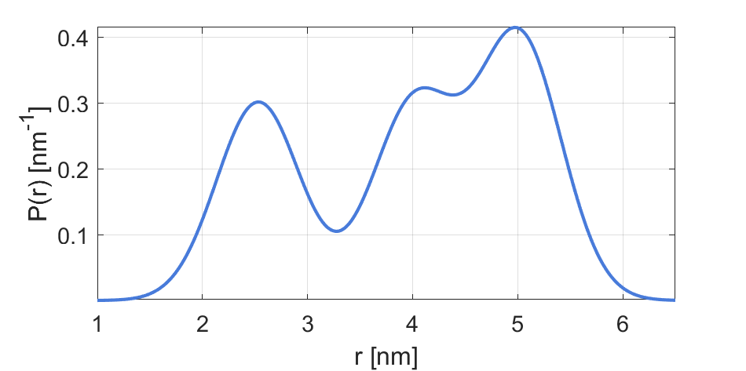

.. highlight:: matlab
.. _dd_rice3:

***********************
:mod:`dd_rice3`
***********************

Sum of three 3D-Rice distributions

-----------------------------

Syntax
=========================================

.. code-block:: matlab

        info = dd_rice3()
        P = dd_rice3(r,param)

Parameters
    *   ``r`` - Distance axis (N-array)
    *   ``param`` - Model parameters
Returns
    *   ``P`` - Distance distribution (N-array)
    *   ``info`` - Model information (struct)

-----------------------------

Model
=========================================

:math:`P(r) = a_1 R(r,\nu_1,\sigma_1) + a_2 R(r,\nu_2,\sigma_2) + a_3 R(r,\nu_3,\sigma_3)`

:math:`R(r,\nu,\sigma) = \frac{\nu^{n/2-1}}{\sigma^2}r^{n/2}\exp\left(-\frac{(r^2+\nu^2)}{2\sigma^2}\right)I_{n/2-1}\left(\frac{r\nu}{\sigma^2} \right)`

where :math:`n=3` and :math:`I_{n/2-1}(x)` is the modified Bessel function of the first kind with order :math:`n/2-1`.
This is a three-dimensional non-central chi distribution, the 3D generalization of the 2D Rice distribution.

============== ======================== ========= ======== ======== ===============================
 Variable       Symbol                   Default   Lower   Upper       Description
============== ======================== ========= ======== ======== ===============================
``param(1)``   :math:`\nu_1`                2.5     1.0      10      1st Rician center distance
``param(2)``   :math:`\sigma_1`             0.7     0.1      5       1st Rician width
``param(3)``   :math:`a_1`                  0.3     0        1       1st Rician amplitude
``param(4)``   :math:`\nu_2`                4.0     1.0      10      2nd Rician center distance
``param(5)``   :math:`\sigma_2`             0.7     0.1      5       2nd Rician width
``param(6)``   :math:`a_2`                  0.3     0        1       2nd Rician amplitude
``param(7)``   :math:`\nu_3`                5.0     1.0      10      3rd Rician center distance
``param(8)``   :math:`\sigma_3`             0.7     0.1      5       3rd Rician width
``param(9)``   :math:`a_3`                  0.3     0        1       3rd Rician amplitude
============== ======================== ========= ======== ======== ===============================

Example using default parameters:

-----------------------------

Description
=========================================

.. code-block:: matlab

        info = dd_rice3()

Returns an ``info`` structure containing the information of the model parameters and boundaries.

* ``info(n).Index`` -  Index of the parameter in the ``param`` array.
* ``info(n).Parameter`` -  Description of the n-th parameter.
* ``info(n).Lower`` -  Lower bound of the n-th parameter.
* ``info(n).Upper`` -  Upper bound of the n-th parameter.
* ``info(n).Start`` -  Start value of the n-th parameter.

-----------------------------

.. code-block:: matlab

    P = dd_rice3(r,param)

Computes the distance distribution model ``P`` from the axis ``r`` according to the parameters array ``param``. The required parameters can also be found in the ``info`` structure.

