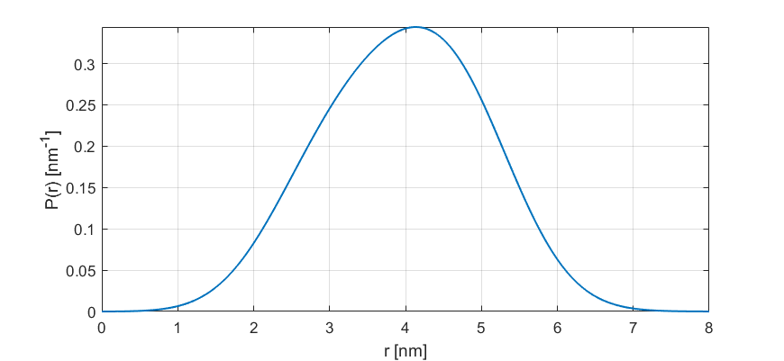

.. highlight:: matlab
.. _dd_rice4:

***********************
:mod:`dd_rice4`
***********************

Sum of four 3D-Rice distributions

-----------------------------

Syntax
=========================================

.. code-block:: matlab

        info = dd_rice4()
        P = dd_rice4(r,param)

Parameters
    *   ``r`` - Distance axis (N-array)
    *   ``param`` - Model parameters
Returns
    *   ``P`` - Distance distribution (N-array)
    *   ``info`` - Model information (struct)

-----------------------------

Model
=========================================

:math:`P(r) = A_1 R(r,\nu_1,\sigma_1) + A_2 R(r,\nu_2,\sigma_2) + A_3 R(r,\nu_3,\sigma_3) + (1-A_1-A_2-A_3) R(r,\nu_4,\sigma_4)`

:math:`R(r,\nu,\sigma) = \frac{\nu^{n/2-1}}{\sigma^2}r^{n/2}\exp\left(-\frac{(r^2+\nu^2)}{2\sigma^2}\right)I_{n/2-1}\left(\frac{r\nu}{\sigma^2} \right)`

where :math:`n=4` and :math:`I_{n/2-1}(x)` is the modified Bessel function of the first kind with order :math:`n/2-1`.
This is a three-dimensional non-central chi distribution, the 3D generalization of the 2D Rice distribution.

============== ======================== ========= ======== ========= ===================================
 Variable       Symbol                    Default   Lower    Upper       Description
============== ======================== ========= ======== ========= ===================================
``param(1)``   :math:`\left<r_1\right>`     2.5     1.0        20         center, 1st component
``param(2)``   :math:`\sigma_1`             0.7     0.1        5          width, 1st component
``param(3)``   :math:`\left<r_2\right>`     3.5     1.0        20         center, 2nd component
``param(4)``   :math:`\sigma_2`             0.7     0.1        5          width, 2nd component
``param(5)``   :math:`\left<r_3\right>`     4.5     1.0        20         center, 3rd component
``param(6)``   :math:`\sigma_3`             0.7     0.1        5          width. 3rd component
``param(7)``   :math:`\left<r_3\right>`     5.5     1.0        20         center, 4th component
``param(8)``   :math:`\sigma_3`             0.7     0.1        5          width. 4th component
``param(9)``   :math:`A_1`                  0.25     0          1         amplitude, 1st component
``param(10)``  :math:`A_2`                  0.25     0          1         amplitude, 2nd component
``param(11)``  :math:`A_3`                  0.25     0          1         amplitude, 3rd component
============== ======================== ========= ======== ========= ===================================

Example using default parameters:

-----------------------------

Description
=========================================

.. code-block:: matlab

        info = dd_rice4()

Returns an ``info`` structure containing the specifics of the model:

* ``info.model`` -  Full name of the parametric model.
* ``info.nparam`` -  Total number of adjustable parameters.
* ``info.parameters`` - Structure array with information on individual parameters.

-----------------------------

.. code-block:: matlab

    P = dd_rice4(r,param)

Computes the distance distribution model ``P`` from the axis ``r`` according to the parameters array ``param``. The required parameters can also be found in the ``info`` structure.

