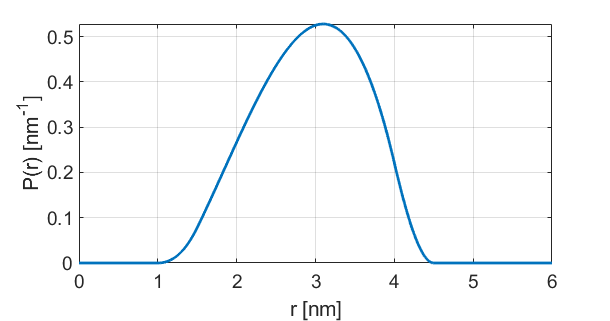

.. highlight:: python
.. _dd_shellvoidsphere:

***************************
:mod:`dd_shellvoidsphere`
***************************

.. autofunction:: deerlab.dd_models.dd_shellvoidsphere

Model
=========================================

.. image:: ../images/model_scheme_dd_shellvoidsphere.png
   :width: 25%

:math:`P(r) = ((R_3^3 - R_1^3)P_\mathrm{BS}(r|R_1,R_3) - (R_2^3 - R_1^3)P_\mathrm{BS}(r|R_1,R_2) )/(R_3^3 - R_2^3)`

with 

:math:`P_\mathrm{BS}(r|R_i,R_j) = \frac{3}{16R_i^3(R_j^3 - R_i^3)}\begin{cases} 12r^3R_i^2 - r^5  \quad \text{for} \quad 0\leq r < \min(2R_i,R_j - R_i) \\ 8r^2(R_j^3 - R_i^3) - 3r(R_j^2 - R_i^2)^2 - 6r^3(R_j - R_i)(R_j + R_i) \quad \text{for} \quad R_j-R_i \leq r < 2R_i \\ 16r^2R_i^3 \quad \text{for} \quad 2R_i\leq r < R_j - R_i  \\  r^5 - 6r^3(R_j^2 + R_i^2) + 8r^2(R_j^3 + R_i^3) - 3r(R_j^2 - R1_2)^2 \quad \text{for} \quad \max(R_j-R_i,2R_i) \leq r < R_i+R_j \\ 0 \quad \text{for} \quad \text{otherwise}  \end{cases}`

and

:math:`R_1 = R`

:math:`R_2 = R + d`

:math:`R_3 = R + d + w`

============== ============== ============= ============= ============= ==============================
 Variable         Symbol       Start Value   Lower bound   Upper bound      Description
============== ============== ============= ============= ============= ==============================
``param[0]``     :math:`R`       1.5            0.1            20        Sphere radius (nm)
``param[1]``     :math:`w`       1.0            0.1            20        Shell thickness (nm)
``param[2]``     :math:`d`       0.5            0.1            20        Shell-Sphere separation (nm)
============== ============== ============= ============= ============= ==============================

Example using start values:

References
=========================================

[1] D.R. Kattnig, D. Hinderberger, Journal of Magnetic Resonance, 230 (2013), 50-63.
`DOI:  10.1016/j.jmr.2013.01.007 <http://doi.org/10.1016/j.jmr.2013.01.007>`_