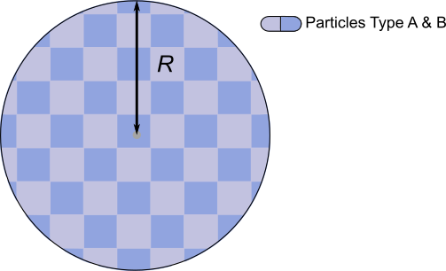

.. highlight:: python
.. _dd_sphere:

************************
:mod:`dd_sphere`
************************

.. autofunction:: deerlab.dd_models.dd_sphere

Model
=========================================

:math:`P(r) = \begin{cases} \frac{3r^5}{16R^6} - \frac{9r^3}{4R^4} + \frac{3r^2}{R^3} \quad \text{for} \quad 0 \leq r < 2R \\ 0 \quad \text{for} \quad \text{otherwise}  \end{cases}`

============== ============== ============= ============= ============= =========================
 Variable         Symbol       Start Value   Lower bound   Upper bound      Description
============== ============== ============= ============= ============= =========================
``param[0]``     :math:`R`       2.5            0.1            20         Sphere radius (nm)
============== ============== ============= ============= ============= =========================

Example using start values:

.. image:: ../images/model_dd_sphere.png
   :width: 650px

References
=========================================

[1] D.R. Kattnig, D. Hinderberger, Journal of Magnetic Resonance, 230 (2013), 50-63.
`DOI:  10.1016/j.jmr.2013.01.007 <http://doi.org/10.1016/j.jmr.2013.01.007>`_