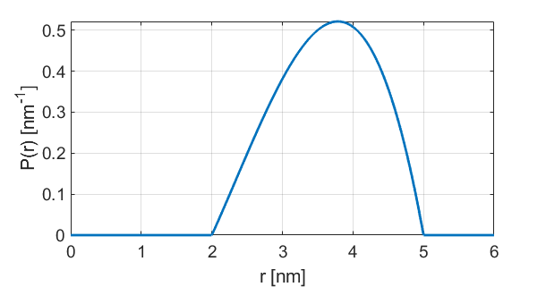

.. highlight:: python
.. _dd_spherepoint:

************************
:mod:`dd_spherepoint`
************************

.. autofunction:: deerlab.dd_models.dd_spherepoint

Model
=========================================

.. image:: ../images/model_scheme_dd_spherepoint.png
   :width: 25%

:math:`P(r) = \begin{cases} \frac{3r(R^2-(d-r)^2)}{4dR^3} \quad \text{for} \quad d-R \leq r < d+R \\ 0 \quad \text{for} \quad \text{otherwise}  \end{cases}`

============== ============== ============= ============= ============= =========================
 Variable         Symbol       Start Value   Lower bound   Upper bound      Description
============== ============== ============= ============= ============= =========================
``param[0]``     :math:`R`       1.5            0.1            20        Sphere radius (nm)
``param[1]``     :math:`d`       3.5            0.1            20        Distance to point (nm)
============== ============== ============= ============= ============= =========================

Example using start values:

References
=========================================

[1] D.R. Kattnig, D. Hinderberger, Journal of Magnetic Resonance, 230 (2013), 50-63.
`DOI:  10.1016/j.jmr.2013.01.007 <http://doi.org/10.1016/j.jmr.2013.01.007>`_