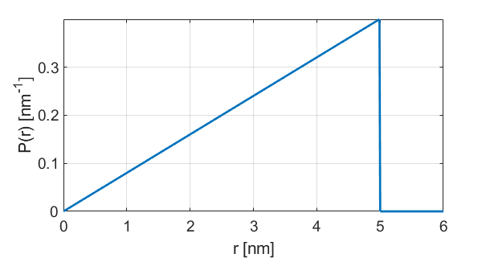

.. highlight:: python
.. _dd_spheresurf:

************************
:mod:`dd_spheresurf`
************************

.. autofunction:: deerlab.dd_models.dd_spheresurf

Model
=========================================

.. image:: ../images/model_scheme_dd_spheresurf.png
   :width: 25%

:math:`P(r) = \begin{cases} \frac{r}{2R^2} \quad \text{for} \quad 0 \leq r < 2R \\ 0 \quad \text{for} \quad \text{otherwise}  \end{cases}`

================ ============== ========= ======== ========= ===================================
 Variable         Symbol         Default   Lower    Upper       Description
================ ============== ========= ======== ========= ===================================
``param(1)``     :math:`R`       2.5       0.1        20        Sphere radius
================ ============== ========= ======== ========= ===================================

Example using default parameters:

References
=========================================

[1] D.R. Kattnig, D. Hinderberger, Journal of Magnetic Resonance, 230 (2013), 50-63.
`DOI:  10.1016/j.jmr.2013.01.007 <http://doi.org/10.1016/j.jmr.2013.01.007>`_