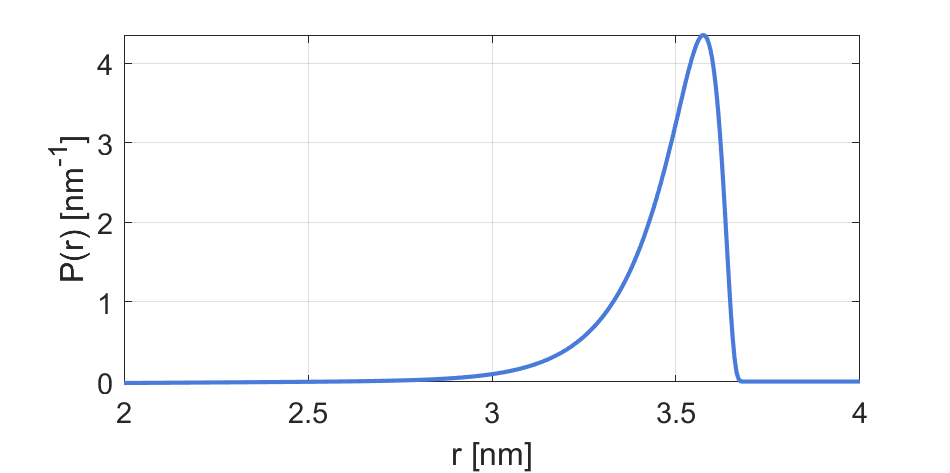

.. highlight:: matlab
.. _dd_wormchain:

***********************
:mod:`dd_wormchain`
***********************

Worm-like chain model near the rigid limit

-----------------------------

Syntax
=========================================

.. code-block:: matlab

        info = dd_wormchain()
        P = dd_wormchain(r,param)

Parameters
    *   ``r`` - Distance axis (N-array)
    *   ``param`` - Model parameters
Returns
    *   ``P`` - Distance distribution (N-array)
    *   ``info`` - Model information (struct)

-----------------------------

Model
=========================================

============== =========== ======== ======== ======== ===============================
 Variable       Symbol     Default   Lower   Upper       Description
============== =========== ======== ======== ======== ===============================
``param(1)``   :math:`L`      3.7     1.5      10       Contour length
``param(2)``   :math:`L_p`    10      2        100      Persistence length
============== =========== ======== ======== ======== ===============================

Example:

-----------------------------

Description
=========================================

.. code-block:: matlab

        info = dd_wormchain()

Returns an ``info`` structure containing the specifics of the model:

* ``info.model`` -  Full name of the parametric model.
* ``info.nparam`` -  Total number of adjustable parameters.
* ``info.parameters`` - Structure array with information on individual parameters.

-----------------------------

.. code-block:: matlab

    P = dd_wormchain(r,param)

Computes the distance distribution model ``P`` from the axis ``r`` according to the parameters array ``param``. The required parameters can also be found in the ``info`` structure.

References
=========================================

[1] J. Wilhelm, E. Frey, Phys. Rev. Lett. 77(12), 2581-2584 (1996)
DOI:  `10.1103/PhysRevLett.77.2581 <https://doi.org/10.1103/PhysRevLett.77.2581>`_