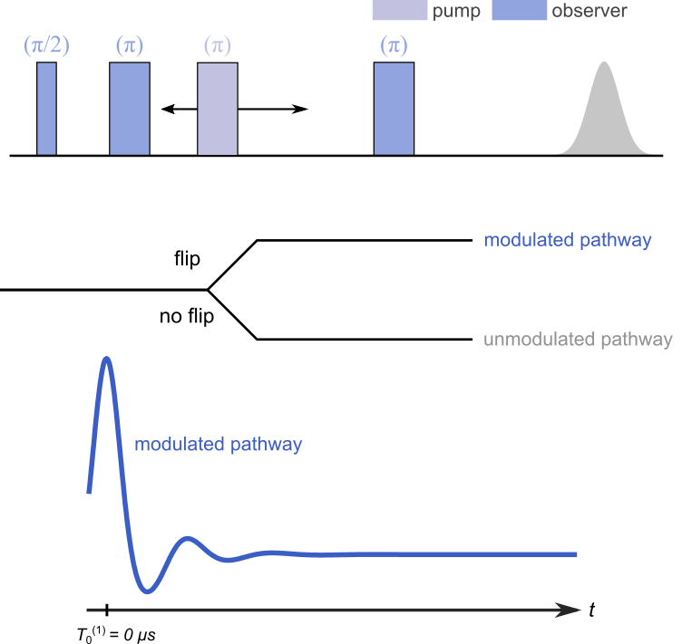

.. highlight:: python
.. _ex_4pdeer:

***********************
:mod:`ex_4pdeer`
***********************

.. autofunction:: deerlab.ex_models.ex_4pdeer

Model
=========================================

This experiment model has one modulated pathway and an unmodulated contribution. The kernel is 

.. math::
   K(t,r) =
   [1-\lambda + \lambda K_0(t-T_0^{(1)},r)]B(t-T_0^{(1)},\lambda)

where :math:`T_0^{(1)}=0` is the refocusing time of the modulated dipolar pathway.

============== ================ ============ ============ ============ ================================================
 Variable        Symbol           Default       Lower        Upper                Description
============== ================ ============ ============ ============ ================================================
``param(1)``   :math:`\lambda`     0.3           0            1          modulated pathway amplitude (modulation depth)
============== ================ ============ ============ ============ ================================================

Example of a simulated signal using default parameters:

.. image:: ../images/model_ex_4pdeer.png
   :width: 550px
