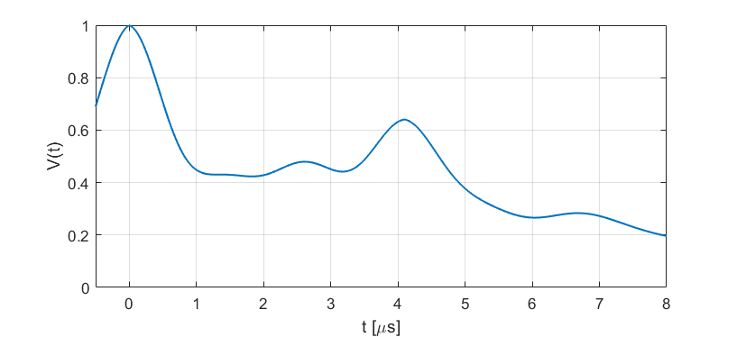

.. highlight:: matlab
.. _ex_5pdeer:

***********************
:mod:`ex_5pdeer`
***********************

5-pulse DEER experiment 

-----------------------------

Syntax
=========================================

.. code-block:: matlab

        info = ex_5pdeer()
        pathways = ex_5pdeer(param)

Parameters
    *   ``param`` - Model parameters (array)
Returns
    *   ``pathways`` - Dipolar pathways (array)
    *   ``info`` - Model information (struct)

-----------------------------

Model
=========================================

.. image:: ../images/model_scheme_ex_5pdeer.png
   :width: 550px

This experiment model has two modulated pathway and an unmodulated contribution. The kernel is 

.. math::
   K(t,r) =
   [\varLambda_0 + \lambda_1 K_0(t-T_0^{(1)},r) + \lambda_2 K_0(t-T_0^{(2)},r)]
   B(t-T_0^{(1)},\lambda_1) B(t - T_0^{(2)},\lambda_2)

where :math:`T_0^{(1)}=0` and :math:`T_0^{(2)}` are the refocusing times of the two modulated dipolar pathways.

============== ======================== ================= ==================== ==================== =============================================
 Variable        Symbol                   Default          Lower                Upper                Description
============== ======================== ================= ==================== ==================== =============================================
``param(1)``   :math:`\varLambda_0`     0.4                0                    1                    unmodulated pathways, amplitude
``param(2)``   :math:`\lambda_1`        0.4                0                    1                    1st modulated pathway, amplitude
``param(3)``   :math:`\lambda_2`        0.2                0                    1                    2nd modulated pathway, amplitude
``param(4)``   :math:`T_0^{(2)}`        5.0                0                    20                   2nd modulated pathway, refocusing time (us)
============== ======================== ================= ==================== ==================== =============================================

Example of a simulated signal using default parameters:

-----------------------------

Description
=========================================

.. code-block:: matlab

        info = ex_5pdeer()

Returns an ``info`` structure containing the information of the model parameters and boundaries.

* ``info(n).Index`` -  Index of the n-th parameter in the ``param`` array.
* ``info(n).Parameter`` -  Description of the n-th parameter.
* ``info(n).Lower`` -  Lower bound of the n-th parameter.
* ``info(n).Upper`` -  Upper bound of the n-th parameter.
* ``info(n).Start`` -  Start value of the n-th parameter.

-----------------------------

.. code-block:: matlab

        pathways = ex_5pdeer(param)

Generates the dipolar pathways matrix ``pathways`` from the model parameters ``param``. 

