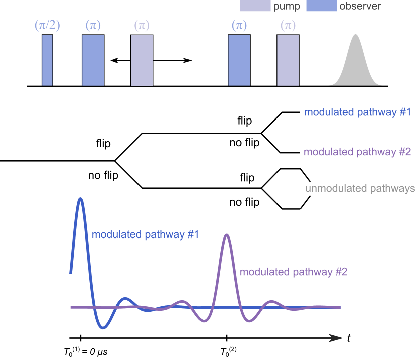

.. highlight:: python
.. _ex_5pdeer:

***********************
:mod:`ex_5pdeer`
***********************

.. autofunction:: deerlab.ex_models.ex_5pdeer

Model
=========================================

This experiment model has two modulated pathway and an unmodulated contribution. The kernel is 

.. math::
   K(t,r) =
   [\varLambda_0 + \lambda_1 K_0(t-T_0^{(1)},r) + \lambda_2 K_0(t-T_0^{(2)},r)]
   B(t-T_0^{(1)},\lambda_1) B(t - T_0^{(2)},\lambda_2)

where :math:`T_0^{(1)}=0` and :math:`T_0^{(2)}` are the refocusing times of the two modulated dipolar pathways.

============== ======================== ============= ============ ============ ================================================
 Variable        Symbol                  Start Values     Lower        Upper                Description
============== ======================== ============= ============ ============ ================================================
``param[0]``   :math:`\varLambda_0`          0.4            0            1       Unmodulated pathways, amplitude
``param[1]``   :math:`\lambda_1`             0.4            0            1       1st modulated pathway, amplitude
``param[2]``   :math:`\lambda_2`             0.2            0            1       2nd modulated pathway, amplitude
``param[3]``   :math:`T_0^{(2)}`             5.0            0            20      2nd modulated pathway, refocusing time (μs)
============== ======================== ============= ============ ============ ================================================

Example
=========================================

Example of a simulated signal using the model evaluated at the start values of its parameters:

.. plot::

   import deerlab as dl
   import matplotlib.pyplot as plt 
   import numpy as np 
   model = dl.ex_5pdeer
   t = np.linspace(-0.5,8,400)
   r = np.linspace(2,5,200)
   info = dl.dd_gauss()
   par0 = info['Start']
   P = dl.dd_gauss(r,par0)
   info = model()
   par0 = info['Start']
   paths = model(par0)
   K = dl.dipolarkernel(t,r,paths,lambda t,lam: dl.bg_hom3d(t,80,lam))
   V = K@P
   plt.figure(figsize=[6,3])
   plt.plot(t,V)
   plt.xlabel('t (µs)',fontsize=13)
   plt.ylabel('V',fontsize=13)
   plt.grid(alpha=0.4)
   plt.tick_params(labelsize=12)
   plt.tick_params(labelsize=12)
   plt.tight_layout()