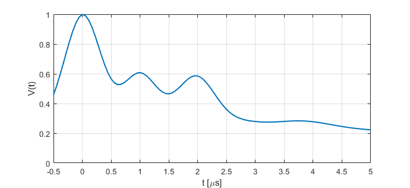

.. highlight:: python
.. _ex_7pdeer:

***********************
:mod:`ex_7pdeer`
***********************

.. autofunction:: deerlab.ex_models.ex_7pdeer

Model
=========================================

.. image:: ../images/model_scheme_ex_7pdeer.png
   :width: 650px

In order to reduce the parameter space, only the dipolar pathways refocusing at positive times (pathways #1-3) are considered in this model:

.. math::

    K(t,r) =
    [\Lambda_0 + \sum^3_{p=1} \lambda_p K_0(t-T_0^{(p)},r)]
    \prod^3_{p=1} B(t - T_0^{(p)},\lambda_p)

where :math:`T_0^{(1)}=0\;\mu s`, :math:`T_0^{(2)}`, and :math:`T_0^{(3)}` are the refocusing times of the three modulated dipolar pathways at positive evolution times.

============== ======================== ================= ==================== ==================== =============================================
 Variable        Symbol                   Default          Lower                Upper                Description
============== ======================== ================= ==================== ==================== =============================================
``param(1)``   :math:`\varLambda_0`     0.4                0                    1                     unmodulated pathways, amplitude
``param(2)``   :math:`\lambda_1`        0.4                0                    1                     1st modulated pathway, amplitude
``param(3)``   :math:`\lambda_2`        0.2                0                    1                     2nd modulated pathway, amplitude
``param(4)``   :math:`\lambda_3`        0.2                0                    1                     3rd modulated pathway, amplitude
``param(5)``   :math:`T_0^{(2)}`        1.5                0                    20                    2nd modulated pathway, refocusing time (us)
``param(6)``   :math:`T_0^{(3)}`        3.5                0                    20                    3rd modulated pathway, refocusing time (us)
============== ======================== ================= ==================== ==================== =============================================

Example of a simulated signal using default parameters:

