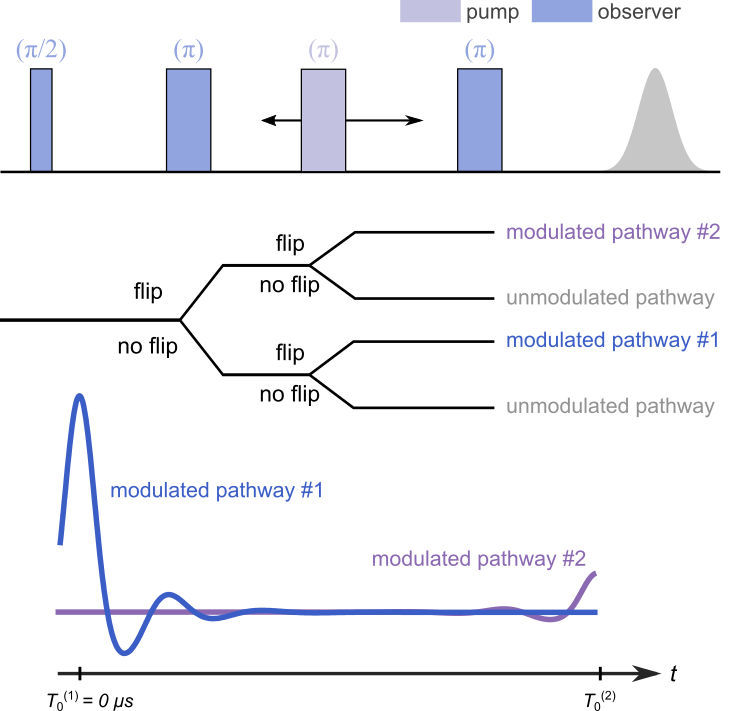
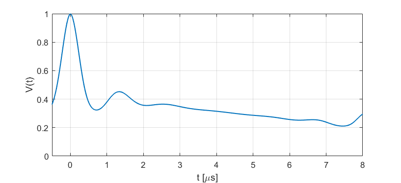

.. highlight:: python
.. _ex_ovl4pdeer:

***********************
:mod:`ex_ovl4pdeer`
***********************

.. autofunction:: deerlab.ex_models.ex_ovl4pdeer

Model
=========================================

This experiment model has two modulated pathways and an unmodulated contribution. The second modulated pathway results in the 2+1 contribution at the end of a 4-pulse DEER trace.The kernel is 

.. math::
   K(t,r) =
   [\Lambda_0 + \lambda_1 K_0(t-T_0^{(1)},r) + \lambda_2 K_0(t-T_0^{(2)},r)]
   B(t-T_0^{(1)},\lambda_1)
   B(t-T_0^{(2)},\lambda_2)

where :math:`T_0^{(1)}=0` and :math:`T_0^{(2)}` are the refocusing times of the two modulated dipolar pathways.

============== ======================== ============= ============ ============ ================================================
 Variable        Symbol                  Start Values     Lower        Upper                Description
============== ======================== ============= ============ ============ ================================================
``param[0]``   :math:`\varLambda_0`        0.1              0            1        Unmodulated pathways, amplitude
``param[1]``   :math:`\lambda_1`           0.8              0            1        1st modulated pathway, amplitude
``param[2]``   :math:`\lambda_2`           0.1              0            1        2nd modulated pathway, amplitude
``param[3]``   :math:`T_0^{(2)}`           5.0              0           20        2nd modulated pathway, refocusing time (μs)
============== ======================== ============= ============ ============ ================================================

Example of a simulated signal using start values:

