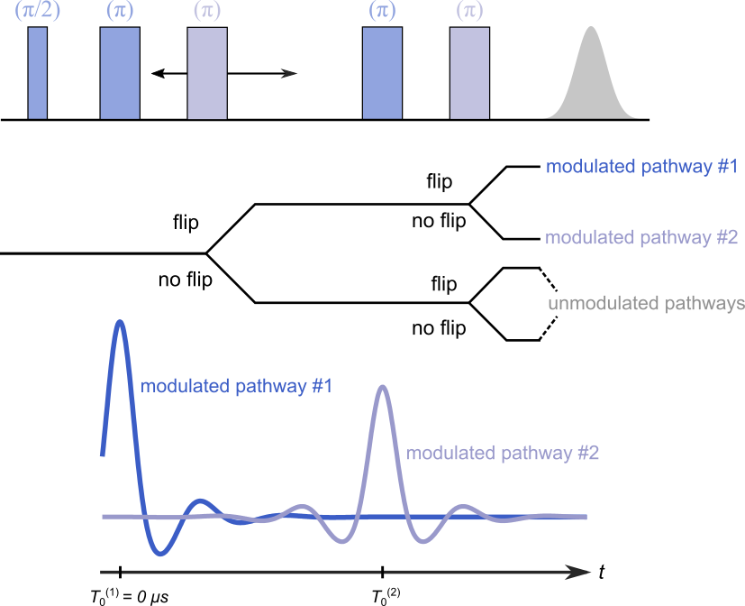

.. highlight:: matlab
.. _exp_5pdeer:

***********************
:mod:`exp_5pdeer`
***********************

5-pulse DEER experiment 

-----------------------------

Syntax
=========================================

.. code-block:: matlab

        info = exp_5pdeer(t)
        K = exp_5pdeer(t,r,param,Bmodel)
        [K,B] = exp_5pdeer(t,r,param,Bmodel)

Parameters
    *   ``t`` - Time axis (*M*-array)
    *   ``r`` - Distance axis (*N*-array)
    *   ``param`` - Model parameters
Returns
    *   ``K`` - Dipolar kernel (*MxN*-array)
    *   ``B`` - Experiment background (*M*-array)
    *   ``info`` - Model information (struct)

-----------------------------

Model
=========================================

:math:`V(t) = [\Lambda_0 + \lambda_1D(t-T_0^{(1)},r) + \lambda_2D(t-T_0^{(2)},r)]B(t)B(t - T_0^{(2)})`

:math:`K(t,r) = [\Lambda_0 + \lambda_1K(t-T_0^{(1)},r) + \lambda_2K(t-T_0^{(2)},r)]B(t)B(t - T_0^{(2)})`

where :math:`T_0^{(1)}=0` and :math:`T_0^{(2)}` are the refocusing times of the two modulated dipolar pathways.

============== ======================== ================= ==================== ==================== ============================================
 Variable        Symbol                   Default          Lower                Upper                Description
============== ======================== ================= ==================== ==================== ============================================
``param(1)``   :math:`\Lambda_0`        0.4                1.0                  0                     unmodulated pathways, amplitude
``param(2)``   :math:`\lambda_1`        0.4                0.1                  0                     1st modulated pathway, amplitude
``param(3)``   :math:`\lambda_2`        0.2                1.0                  0                     2nd modulated pathway, amplitude
``param(4)``   :math:`T_0^{(2)}`        :math:`\max(t)/2`  :math:`\max(t)/2-2`  :math:`\max(t)/2+2`    2nd modulated pathway, refocusing time
============== ======================== ================= ==================== ==================== ============================================

Example of a simulated signal using default parameters:

.. image:: ../images/model_exp_5pdeer.png
   :width: 550px

-----------------------------

Description
=========================================

.. code-block:: matlab

        info = exp_5pdeer(t)

Returns an ``info`` structure containing the specifics of the model:

* ``info.model`` -  Full name of the parametric model.
* ``info.nparam`` -  Total number of adjustable parameters.
* ``info.parameters`` - Structure array with information on individual parameters.

-----------------------------

.. code-block:: matlab

    [K,B] = exp_5pdeer(t,r,param,Bmodel)

Computes the distance distribution model ``P`` from the time axis ``t`` and distance axis ``r`` according to the parameters array ``param``.  The required parameters can also be found in the ``info`` structure. 

The full background ``B`` is also computed from the basic background model ``Bmodel``, which has to be passed as a function of the time-axis ``t``. For example: 

.. code-block:: matlab

    Bmodel = @(t) bg_exp(t,k);
    [K,B] = exp_5pdeer(t,r,param,Bmodel)

