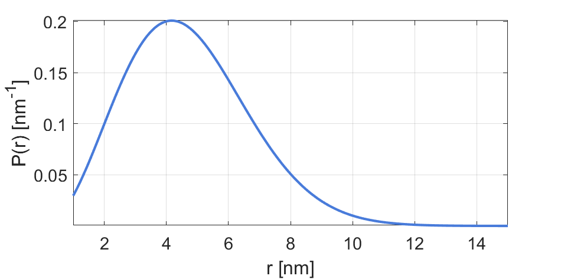

.. highlight:: matlab
.. _rd_randcoil:

***********************
:mod:`rd_randcoil`
***********************

Random-coil model for an unfolded peptide/protein

-----------------------------

Syntax
=========================================

.. code-block:: matlab

        info = rd_randcoil()
        P = rd_randcoil(r,param)

Parameters
    *   ``r`` - Distance axis (N-array)
    *   ``param`` - Model parameters
Returns
    *   ``P`` - Distance distribution (N-array)
    *   ``info`` - Model information (struct)

-----------------------------

Model
=========================================

:math:`P(r) = \frac{3}{(2\pi\nu_0)^{3/2}}4\pi r^2\exp(-\frac{3 r^2}{\nu_0})`

where :math:`\nu_0 = 3/(12\pi r_0 N \nu)^{3/2}` and :math:`r_0` = 0.198 nm.

============== =========== ======== ======== ======== ==================================
 Variable       Symbol     Default   Lower   Upper       Description
============== =========== ======== ======== ======== ==================================
``param(1)``   :math:`N`      50      2        1000    Number of residues between labels
``param(2)``   :math:`\nu`    0.602   0.33     1       Scaling exponent
============== =========== ======== ======== ======== ==================================

Example using default parameters:

-----------------------------

Description
=========================================

.. code-block:: matlab

        info = rd_randcoil()

Returns an ``info`` structure containing the specifics of the model:

* ``info.model`` -  Full name of the parametric model.
* ``info.nparam`` -  Total number of adjustable parameters.
* ``info.parameters`` - Structure array with information on individual parameters.

-----------------------------

.. code-block:: matlab

    P = rd_randcoil(r,param)

Computes the model distance distribution ``P`` of residue-to-residue distances ``r`` according to the parameters array ``param``. The required parameters can also be found in the ``info`` structure.

